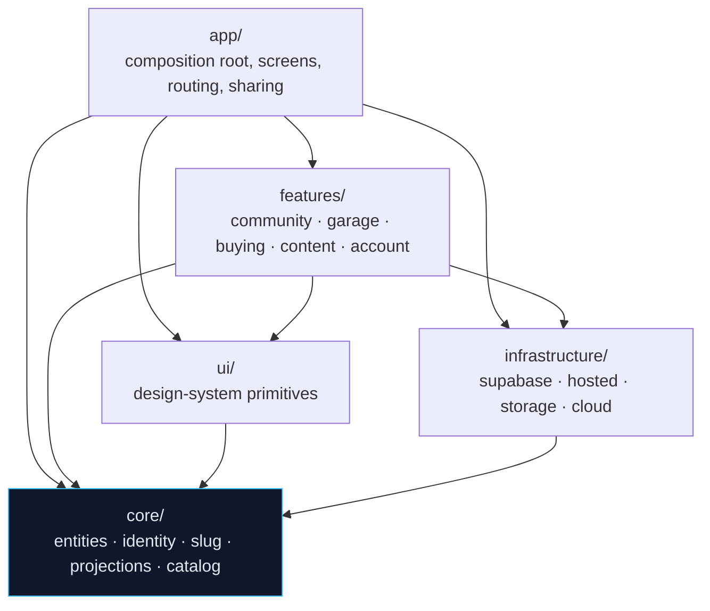

# AutoFlex architecture

AutoFlex is a local-first React app: every screen renders from `localStorage`
before any network call is made, and no hosted call may block a render or
throw. This document describes the module layering that protects that property,
the rules that are enforced in code, and the seams that are deliberately still
uncut.

The layering was introduced by a pure restructuring pass. No product behaviour,
copy, route, element id or storage key changed.

---

## 1. Folder structure

```
src/
  core/                      pure domain — no React, no Supabase, no browser API
    entities.ts              every domain type + the seed/reference data
    identity.ts              modelKeyFor / slugifyCity — the two keys everything joins on
    slug.ts                  URL-safe slug value objects (slugify, safeSlug, citySlugFor, modelSlugFor)
    money.ts                 owner-facing currency formatting
    notebooks.ts             groupByModel — constructor for the ModelNotebook entity
    postQuality.ts           assessPostQuality — a domain invariant, not a feature preference
    projections.ts           read-model shapes that cross the feature/infrastructure boundary
    catalog/                 carData, vehicleCatalog, vehicleFacts (frozen market contract)
    index.ts                 the core public API

  infrastructure/            adapters — they know the domain, never a feature
    supabase/                client, generated database.types, table registry, auth session read
    hosted/                  the non-throwing HostedResult data layer
      kernel/                result, cache, coerce, limits — the shared adapter kernel
      <table>.ts             one module per hosted surface
      syncAll.ts             whole-workspace merge
      index.ts               the hosted public API
    storage/localStore.ts    the local-first localStorage repository
    cloud/cloudSync.ts       account backup/restore + sign-in link

  ui/                        design-system primitives, shared across features
    cn.ts                    the class-merge helper + the focus/touch constants
    primitives.tsx           buttons, cards, fields, badges, EmptyState
    Skeleton.tsx             loading placeholders that reserve the real box
    ErrorState.tsx           the quiet hosted-failure notice
    LiveRegion.tsx           the always-mounted polite announcer
    AsyncBoundary.tsx        loading / error / empty / content in one place
    useFocusTrap.ts          Tab containment for overlays
    VehicleFactGrid.tsx      renders core catalog facts
    ErrorBoundary.tsx        Hero3D.tsx        index.ts

  features/                  one folder per bounded context
    community/  garage/  buying/  content/  account/
      domain/                pure feature logic (split out of the old insights.ts)
      data/<f>Repository.ts  the feature's remote surface — an explicit re-export list
      hooks/                 use<F>Derived (read models) and use<F>Actions (mutations)
      ui/                    feature-specific components
      index.ts               the feature's deliberate public API

  app/                       composition root
    App.tsx                  shell composition
    state/appState.tsx       the one provider — state, effects, hosted orchestration
    state/usePersistence.ts  the local-first write policy
    routing/routes.ts        path <-> route tables
    sharing/share.ts         deep links, canonical URLs, the Web Share ladder
    shell/Shell.tsx          sidebar, topbar, dock, workspace header
    screens/                 the ten route targets

  main.tsx  styles.css       browser entry point
```

---

## 2. Layer rules

Dependencies point inward only.

| Layer | May import |
| --- | --- |
| `core/` | `core/` only |
| `infrastructure/` | `core/`, `infrastructure/` |
| `ui/` | `core/`, `ui/` |
| `features/<f>/` | `core/`, `infrastructure/`, `ui/`, its own feature, and another feature **only through that feature's `index.ts`** |
| `app/` | everything |

Additional rules:

- `core/` may not import `react`, `react-dom`, `react-router-dom`,
  `@supabase/supabase-js`, `three` or `lucide-react`, and may not reference
  `window`, `document`, `localStorage`, `sessionStorage`, `navigator` or
  `fetch`. Core has to be runnable in a plain Node test with no DOM.
- `infrastructure/` may never import `features/`. This is why the read-model
  shapes the hosted tables persist (`CityCircle`, `OwnershipPlaybook`,
  `GarageReminder`, `InspectionChecklist`) live in `core/projections.ts` while
  their *builders* stay with the feature that owns the rules.
- Everything under `features/<f>/` that is not re-exported from
  `features/<f>/index.ts` is internal to that feature.
- Nothing may import `src/main.tsx`.

### Dependency diagram



Cross-feature edges are not in the diagram because there are none in the
production graph today. When one is needed it must land on the target feature's
`index.ts`, and the guard test checks that.

### How the rules are enforced

`tests/architecture/layers.test.ts` walks every `.ts`/`.tsx` file under `src/`,
extracts every static import, dynamic `import()` and `vi.mock()` specifier,
resolves each one to a real file, and asserts the table above on **resolved
paths** rather than on the text of the specifier — so a re-export, an alias or a
`../../..` ladder cannot sneak an edge past it. Nine cases run:

1. the scan actually found the tree (guards against a silently empty check)
2. every relative import inside `src/` resolves
3. each layer only imports the layers beneath it
4. `core/` has no outward dependency at all
5. `infrastructure/` has no feature knowledge
6. every cross-feature import lands on the other feature's `index.ts`
7. every feature has exactly one public barrel
8. React, Supabase and the browser stay out of `core/`
9. nobody imports the browser entry point

Test files are exempt from rule 3 and rule 5 only: a test may build fixtures
with whatever it asserts against (for example `hosted/mappers.test.ts` uses
`buildCityCircles` to make a realistic input), and tests are not part of the
shipped dependency graph. They are still held to the barrel rule.

The guard was verified by introducing a deliberate `core → features` import and
confirming cases 3, 4 and 6 went red.

---

## 3. What moved, and why

### `insights.ts` (1,429 lines) → `core/` + five feature domain folders

The file was one namespace holding every derived value in the product. It was
split by responsibility, not by size: each function moved to the bounded context
that owns the rule it encodes.

| Destination | What went there |
| --- | --- |
| `core/identity.ts` | `modelKeyFor`, `slugifyCity` — every feature and the hosted tables join on these |
| `core/notebooks.ts` | `groupByModel` — community and content both read notebooks |
| `core/money.ts` | `formatMoney` |
| `core/postQuality.ts` | `assessPostQuality` + its report types — the composer scores live, `hosted/quality` persists the same report |
| `core/projections.ts` | `CityCircle`, `OwnershipPlaybook`, `GarageReminder`, `InspectionChecklist(Item)` — shapes both a feature and the hosted layer must agree on |
| `features/community/domain/` | `feed` (`filterPostsByMode`), `moderation`, `notifications` (preview + job drafts), `sharePayload` |
| `features/garage/domain/` | `insights`, `costs`, `reminders`, `analytics`, `exportMarkdown` |
| `features/buying/domain/` | `shortlist` (comparisons + decision lanes), `inspection` (checklists) |
| `features/content/domain/` | `cityCircles`, `playbooks`, `evidence`, `topValues` |
| `features/account/domain/` | `onboarding`, `connection`, `feedback`, `readiness`, `qaHandoff` |

The split was validated before it was applied: the reference graph between the
proposed modules was computed and checked for cross-feature and core-outward
edges, and there were none — the seams were already there, they just had no
folders. `insights.test.ts` was split the same way, its 33 cases moving to the
six suites that now sit next to the code they cover.

### `appState.tsx` (1,590 lines) → composition root + feature hooks

`useApp()` is unchanged and still returns one object, so every screen kept
working untouched. What changed is where the work is done.

| Moved to | What |
| --- | --- |
| `infrastructure/supabase/auth.ts` | the Supabase session read |
| `app/state/usePersistence.ts` | `noteLocalWrite` + the eight `persist*` helpers — the local-first write policy |
| `features/*/domain/drafts.ts` | the four empty composer seeds |
| `features/community/hooks/` | `useCommunityDerived` (feed, follow sets, ranking, moderation summary, quality reports) and `useCommunityActions` (save, follow, helpful, fix, comment, report, moderate, publish, share) |
| `features/garage/hooks/` | `useGarageDerived` (cost ledger, reminders, timeline analytics) and `useGarageActions` (add vehicle, add record, select vehicle, export) |
| `features/buying/hooks/` | `useBuyingDerived` (comparisons, lanes, checklists, hosted inspection merge) and `useBuyingActions` (shortlist CRUD) |
| `features/content/hooks/` | `useContentDerived` (city circles, playbooks) |
| `features/account/hooks/` | `useConnectionStatus` (online/offline) and `useAccountActions` (backup, restore, wipe, the four account-sync actions) |

Every feature hook takes the state it reads as an **explicit argument** instead
of reaching into a context. That is what makes each one testable without
mounting the provider, and it makes the coupling visible in a type signature
rather than hidden in a closure.

Two dependencies pointed the wrong way and were inverted with **ports** rather
than by moving files. `useCommunityActions` declares `SharePostPort` and
`SharePlaybookPort`; `useGarageActions` declares `ShareTextPort`. The feature
says *what* it wants shared; `app/state/appState.tsx` supplies *how* (the Web
Share → clipboard → manual ladder) and which route the link points at. Without
this the features would have had to import `app/sharing/share.ts`.

The composition root kept, on purpose: all 44 `useState` declarations, all 23 DOM
refs, the hosted sync orchestration (`applyHostedWorkspace`,
`refreshHostedForUser`, `runHostedSync`), the route-sync effect, the
navigation/composer/focus handlers, `workspaceCopy`, and the single returned
object. Those are genuinely cross-feature.

### Everything else

- `domain.ts` → `core/entities.ts`; `carData`/`vehicleCatalog`/`vehicleFacts` →
  `core/catalog/`.
- `hosted/**` → `infrastructure/hosted/**`, with `result`/`cache`/`coerce`/
  `limits` gathered into `hosted/kernel/` and `tables.ts` moved next to the
  generated types in `infrastructure/supabase/`.
- `storage.ts` → `infrastructure/storage/localStore.ts`;
  `supabase.ts` → `infrastructure/supabase/client.ts`;
  `cloudSync.ts` → `infrastructure/cloud/cloudSync.ts`.
- `components/ui.tsx` → `ui/primitives.tsx`; `VehicleFactGrid`, `ErrorBoundary`
  and `Hero3D` joined it. `PostCard` went to `features/community/ui/` because it
  renders an `OwnerPost` and nothing else uses it.
- `routing.ts` → `app/routing/routes.ts`; `share.ts` → `app/sharing/share.ts`;
  `screens/` → `app/screens/`; `Shell.tsx` → `app/shell/`.
- `citySlugFor`/`modelSlugFor` and their slug pattern moved out of `share.ts`
  into `core/slug.ts`, because the content feature keys local city circles by
  the same rule and could not be allowed to import the app layer to get it.
  `share.ts` re-exports them, so its callers were unaffected.

### Path aliases: considered and rejected

`tsconfig` path aliases were evaluated and not adopted. `server-ts/` imports
`src/core/entities.ts` and `src/infrastructure/storage/localStore.ts` and is run
directly through `tsx` at runtime, where `tsconfig` `paths` resolution is not
guaranteed. Relative imports keep one resolution model for the browser bundle,
the Vitest run and the Fastify server. The layer guard resolves specifiers to
real file paths, so it does not depend on import style either way.

---

## 4. Seams deliberately not cut

Each of these is a known, priced decision — not an oversight.

**Screens still bind to the aggregate `useApp()` context, and live in `app/`.**
The ten route targets are the delivery mechanism, which in this layering is the
outermost ring. Moving them under `features/*/ui/` while they still read one
merged context would invert the dependency (`features → app`) and trade a real
rule for a cosmetic folder move. The path out is per-feature contexts: each
feature already exposes its `use<F>Derived`/`use<F>Actions` pair, so a screen can
be migrated one at a time, and `useApp()` stays as the compatibility shim until
the last one is done.

**`appState.tsx` is still ~1,050 lines.** What remains is 44 `useState`
declarations, 23 DOM refs, the hosted sync orchestration, the route-sync effect
and a 140-line returned object. Splitting the state itself into per-feature
providers is the next real step, but `applyHostedWorkspace` writes every slice
at once from a single merged sync result, so it has to be done together with the
sync orchestration rather than before it.

**`infrastructure/hosted/` was kept whole rather than distributed into the
features.** It is one cohesive Supabase adapter: a shared kernel, one module per
table, and `syncAll.ts`, which merges the entire workspace across all five
contexts in one pass. Splitting the per-table modules into `features/*/data/`
would have left `syncAll` importing five features from inside infrastructure —
exactly the edge the rules forbid. Instead each feature owns a
`data/<f>Repository.ts` facade that names, in an explicit re-export list, the
hosted calls that feature is allowed to make; feature hooks import only from
there. The list is the reviewable seam, and it is where a per-feature adapter
would slot in.

**`storage/localStore.ts` is still one 566-line module.** It mixes the generic
primitives (`readStoredJson`, `writeStoredJson`, the key registry, the backup
envelope) with per-entity `load*`/`save*`/`create*` helpers. Splitting the
per-entity helpers into the features would require repository *interfaces* in
`core` and an inversion at the composition root; that is worth doing, but it is
a design change rather than a move, and it is also the module `server-ts/`
imports directly.

**`core/entities.ts` is still 687 lines** — every domain type plus the seed and
static checklist catalogs in one file. It has no imports at all, so it violates
nothing; splitting types from seed data is readability work with no structural
payoff, and it is the file `server-ts/` and `tsconfig.server.json` point at.

**Three separate `slugify` implementations still exist**:
`core/slug.ts`, `infrastructure/hosted/kernel/coerce.ts` and
`core/identity.ts`'s `slugifyCity`. They are near-identical but not provably
identical, and each has tests asserting its exact current output. Consolidating
them is a behaviour question, not a structural one, so it was left alone and
recorded here.

**`ui/` now has a barrel, but not an access boundary.** `src/ui/index.ts` exists
so that moving a primitive between files is not a screen-wide edit; importing
`ui/primitives` directly is still legal and is what the older screens do. `ui/`
is a design-system layer rather than a bounded context, so the barrel is a
convenience rather than a curated public API. See `docs/UI_SYSTEM.md`.

**No screen has a hosted-loading signal yet.** `ui/AsyncBoundary` implements the
loading arm and `ui/Skeleton` reserves the box for it, but `hostedSyncing` lives
in `appState.tsx` and is not on the `useApp()` surface, so no screen can pass
`loading` today. Surfacing it is one line in the returned object — it was left
out on purpose because a visible busy state during background sync is a product
decision, not a UI-layer one. See `docs/UI_SYSTEM.md`.

**Pre-existing dead locals in `appState.tsx` were left in place.** A dozen
`useMemo` results (`vehicleProfileById`, `reminderStatusById`,
`hostedCityBySlug`, `inspectionSessionByItemId`, `hostedCostByVehicleId`,
`feedRankingSource`, `hostedQualityByPostId`) are computed but never surfaced
through `useApp()`. They now live on the relevant feature hook's return value,
so they are available to whoever finishes wiring them, rather than deleted.
Genuinely unused *imports* were removed — that was 31 specifiers, including
20 hosted functions `appState` imported and never called.

---

## 5. Verification

```bash
npm run test    # 422 tests across 29 files
npm run build   # tsc -b + vite build + service-worker manifest
```

The 339 tests that existed before the restructuring all still pass; the 9 new
ones are the dependency-direction guard. The restructuring was verified to be
behaviour-preserving by diffing every string literal in `src/` before and
after — no user-facing copy, route, storage key or element id was lost.
