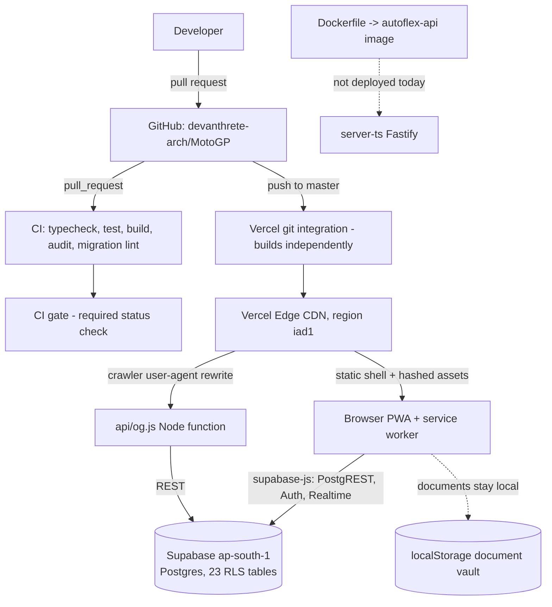

# Autoflex deployment

How Autoflex gets from a pull request to production, what is actually running,
what is monitored, and what to do when it breaks. Incident procedures live in
[RUNBOOK.md](./RUNBOOK.md).

Everything marked **RECOMMENDATION** is not built yet. It is written down with
its cost so it can be decided, not quietly assumed.

---

## 1. What is actually running

| Piece | Where | Notes |
| --- | --- | --- |
| Web app (React 19 + Vite SPA, PWA) | Vercel project `moto-gp`, team `team_UbuCWuxfzZk7x4lvirkSmkvj` | production branch `master`, framework Vite, build `npm run build`, output `dist`, region `iad1` |
| Production URL | https://moto-gp-chi.vercel.app | also `defaultShareOrigin` in `src/share.ts` and the `canonical` in `index.html` |
| OG image/meta function | `api/og.js`, Vercel Node function | reached only through the crawler `rewrites` rule in `vercel.json`; calls Supabase REST |
| Service worker | `dist/sw.js`, generated by `scripts/build-service-worker.mjs` at build time | precaches the whole `dist` listing, cache name is a content hash |
| Database + auth | Supabase project `uxzdmlqyxausmmdpmkrr`, region `ap-south-1` | Postgres, 23 RLS-protected tables, migrations in `supabase/migrations/` |
| Hosted API (`server-ts`, Fastify 5) | **not deployed** | image is built by `Dockerfile`; the browser talks to Supabase directly today |
| Document vault | the user's browser only (`localStorage`) | `src/screens/DocVault.tsx` stores file *names/sizes*; documents never leave the device |

The browser talks to Supabase directly with the publishable (anon) key; row
level security is the authorisation boundary. There is no server in the request
path for normal use - which is why "Supabase is unreachable" and "the service
worker is stale" are the two failure modes that matter most.

### Architecture

```
   developer
       |  pull request                             push to master
       v                                                  |
 +-------------------------------------------+            |
 | GitHub  devanthrete-arch/MotoGP            |------------+
 +---------------------+---------------------+            |
                       |                                  |
        .github/workflows/ci.yml                 Vercel git integration
   typecheck | test | build | audit | migration-lint    (independent!)
                       |                                  |
                  +----v----+                       npm ci && npm run build
                  | CI gate |  <- the required check          |
                  +---------+                                 v
                                               +--------------------------+
                                               | Vercel Edge CDN (iad1)   |
                                               |  dist/  hashed assets    |
                                               |  /sw.js  /manifest.json  |
                                               +----+----------------+----+
                                     static shell   |                | crawler UA
                                                    |                v
                                                    |        +---------------+
                                                    |        | api/og.js     |
                                                    |        | Node function |
                                                    |        +-------+-------+
                                                    v                | REST
 +-------------------+   supabase-js (PostgREST / Auth / Realtime)    |
 | browser (PWA)     |-----------------------------------------------+
 |  service worker   |                                               |
 |  localStorage     |                                               v
 |  document vault   |                          +--------------------------------+
 +-------------------+                          | Supabase  uxzdmlqyxausmmdpmkrr |
                                                | ap-south-1 - Postgres 17       |
                                                | 23 RLS tables - Auth - pooler  |
                                                +--------------------------------+

 server-ts (Fastify) --> Dockerfile --> container image .... not deployed today
```

<details>
<summary>Same diagram as Mermaid</summary>


</details>

---

## 2. Environments

| Environment | URL | Database | Deployed by |
| --- | --- | --- | --- |
| Local | `http://localhost:8080` (`npm run dev`) | production Supabase unless `VITE_SUPABASE_URL` is overridden | developer |
| Preview | `*.vercel.app` per branch/PR | **the same production Supabase project** | Vercel git integration, automatically |
| Production | https://moto-gp-chi.vercel.app | Supabase `uxzdmlqyxausmmdpmkrr` | Vercel git integration on push to `master` |

**This is the biggest environment gap: there is one database.** Preview
deployments, local development and production all write to the same 23 tables.
A destructive migration has no staging environment in which to fail.

> **RECOMMENDATION - a staging database.** Supabase branching (or a second
> project) gives previews their own Postgres, so migrations are rehearsed
> before production sees them.
> *Cost:* a second compute instance (Supabase branching bills per branch-hour),
> plus preview builds need `VITE_SUPABASE_URL`/`VITE_SUPABASE_PUBLISHABLE_KEY`
> set per environment in Vercel.
> *Benefit:* removes the only class of failure in this system that a rollback
> cannot fix. This is the highest-value item on the list.

---

## 3. Deployment workflow

1. Branch from `master`, open a pull request.
2. `.github/workflows/ci.yml` runs five jobs in parallel:
   - **Typecheck** - `tsc -b` over both project references.
   - **Unit tests** - `npm run test` (vitest).
   - **Production build** - `npm run build`, then asserts `dist/index.html`,
     `dist/assets/` and a real `dist/sw.js` exist. The service worker is
     generated *after* `vite build`; if that step is skipped the PWA silently
     stops updating, and nothing else would catch it.
   - **Dependency audit** - blocks on `critical` in the production tree,
     reports `high`/`moderate` to the job summary (see section 9).
   - **Migration lint** - `scripts/check-migrations.mjs` (see section 6).
3. `CI gate` aggregates those five into one status check.
4. Merge to `master`.
5. Vercel builds and promotes the deployment **on its own schedule** - see
   section 4.
6. `.github/workflows/deploy.yml` re-runs the whole of CI on the merge commit,
   then runs `scripts/smoke-production.mjs --wait` against the live URL.
7. Database migrations are a **separate, manual** step
   (`.github/workflows/migrate.yml`) - see section 6.

### Running the pieces by hand

```bash
npm ci
npm run test
npm run build
node scripts/check-migrations.mjs
node scripts/smoke-production.mjs            # against production
node scripts/smoke-production.mjs --url=http://127.0.0.1:4173
```

---

## 4. What actually gates production today (read this one)

**Today, nothing gates it.** Vercel's git integration is connected directly to
GitHub. When a commit lands on `master`, Vercel starts building it immediately -
it does not know that GitHub Actions exists, does not wait for a check, and will
happily promote a commit whose tests are failing. `deploy.yml` runs *beside*
that deploy, not in front of it. Its smoke test is a **detector**: it tells you
production is broken, a few minutes after users could already see it.

Adding CI does not change this by itself. What CI plus branch protection buys is
that **broken code cannot reach `master` through a pull request** - which is how
essentially all changes arrive. Configure it once, as a repo admin:

**GitHub UI:** Settings -> Branches -> Add branch ruleset -> target `master`:
- Require a pull request before merging (1 approval).
- Require status checks to pass -> add **`CI gate`**.
- Require branches to be up to date before merging.
- Block force pushes; do not allow bypass for administrators.

**Or with the `gh` CLI:**

```bash
gh api -X PUT repos/devanthrete-arch/MotoGP/branches/master/protection \
  --input - <<'JSON'
{
  "required_status_checks": { "strict": true, "contexts": ["CI gate"] },
  "enforce_admins": true,
  "required_pull_request_reviews": { "required_approving_review_count": 1 },
  "restrictions": null,
  "allow_force_pushes": false,
  "allow_deletions": false
}
JSON
```

Residual gap even after that: anything that reaches `master` without a PR
(a direct push by someone with bypass, a revert commit pushed straight to the
branch, or a change made in the Vercel dashboard) still deploys unverified.

> **RECOMMENDATION - make the pipeline a real gate.** Turn off Vercel's git
> auto-deploy for `master` and deploy from `deploy.yml` after `verify` passes:
>
> ```jsonc
> // vercel.json
> "git": { "deploymentEnabled": { "master": false } }
> ```
> ```yaml
> # deploy.yml, new job after `verify`
> - run: npx vercel@latest pull --yes --environment=production --token="$VERCEL_TOKEN"
> - run: npx vercel@latest build --prod --token="$VERCEL_TOKEN"
> - run: npx vercel@latest deploy --prebuilt --prod --token="$VERCEL_TOKEN"
> ```
>
> *Cost:* three more secrets (`VERCEL_TOKEN`, `VERCEL_ORG_ID`,
> `VERCEL_PROJECT_ID`), a token to rotate, ~2 extra minutes per release, and
> deploys stop working if GitHub Actions is down.
> *Benefit:* a red test genuinely cannot reach users, and the deployment
> becomes an auditable, re-runnable artifact. Worth doing once the app has
> users who notice an outage.
>
> `vercel.json` currently declares `"git": {"deploymentEnabled": {"master": true}}`
> so today's behaviour is explicit in code rather than only in dashboard state.

---

## 5. Secrets

Nothing in this repo is a secret today: `src/supabase.ts` and `api/og.js` both
fall back to the project URL and the **publishable** key, which are designed to
be public and are already in the shipped JavaScript bundle. Security rests on
RLS policies, not on hiding that key.

| Secret / config | Value type | Lives in | Used by | Rotation |
| --- | --- | --- | --- | --- |
| `VITE_SUPABASE_URL` | public | Vercel env vars (all environments); falls back to a literal in `src/supabase.ts` | browser bundle, `api/og.js` | only when the project moves |
| `VITE_SUPABASE_PUBLISHABLE_KEY` | public (anon) | same | browser bundle, `api/og.js` | Supabase dashboard -> API keys; redeploy to pick it up. Rotating it does **not** revoke access to anything RLS allows anonymously |
| `SUPABASE_SERVICE_ROLE_KEY` | **secret, bypasses RLS** | not used anywhere in this repo - keep it that way | - | if it ever leaks: rotate in the Supabase dashboard immediately, then audit `postgres_logs` |
| `SUPABASE_DB_URL` | **secret** (Postgres connection string) | GitHub Environment `production` -> secret | `.github/workflows/migrate.yml` only | rotate the database password quarterly and after any operator offboards |
| `ADMIN_TOKEN` | **secret** | container env for `server-ts` (not deployed today) | moderation + feedback-list routes | random, >= 24 chars; rotate quarterly. Never `dev-admin` outside local |
| `VERCEL_TOKEN` / `VERCEL_PROJECT_ID` / `VERCEL_TEAM_ID` | secret / ids | GitHub repo secrets (optional) | `deploy.yml` smoke test, to confirm which commit is live | scoped token, 90-day expiry |
| `OG_ALLOWED_HOSTS`, `VITE_PUBLIC_ORIGIN` | config | Vercel env vars | `api/og.js` host allowlist | on domain change |
| `CORS_ORIGINS`, `APP_VERSION`, `API_DATA_PATH`, `RATE_LIMIT_MAX`, `BODY_LIMIT_BYTES` | config | container env for `server-ts` | Fastify API | - |

Rules:
- Secrets are referenced as `${{ secrets.NAME }}` and passed through `env:`.
  No workflow echoes one, and no step enables `set -x`.
- `scripts/apply-migrations.sh` reads `SUPABASE_DB_URL` from the environment and
  never prints it.
- `.dockerignore` excludes `.env*` (except `.env.example`), `*.pem` and `*.key`
  so a stray credential cannot be copied into an image layer.
- The `production` GitHub Environment should have **required reviewers**
  configured; that is what makes `migrate.yml` a human-approved operation
  rather than a button anyone can press.

---

## 6. Database migrations

The app and the schema deploy on **separate timelines**: Vercel promotes a
frontend in ~2 minutes, migrations are applied by hand whenever an operator gets
to it, and users on the PWA may be running a service-worker-cached build that is
*days* old. So at any moment the database is being used by at least two versions
of the client. Every migration must be safe for the oldest one still in the
wild.

### Expand / contract

| Phase | What it does | Safe because |
| --- | --- | --- |
| 1. Expand | Add the new column/table/index. Nullable, or `NOT NULL DEFAULT`. Never rename. | Old clients ignore columns they do not select; new columns with defaults do not break their inserts |
| 2. Backfill | Populate the new shape in batches, idempotently (`update ... where new_col is null limit N`, repeated) | No long lock; safe to re-run after a failure |
| 3. Deploy | Ship the frontend that writes both shapes and reads the new one | Rollback still works: the old column is still there and still populated |
| 4. Contract | Days later, after the old build has aged out of every service worker cache, drop the old column | Nothing reads it any more |

A rename is never one migration. It is: add `new`, backfill, dual-write, switch
reads, stop writing `old`, drop `old`.

`scripts/check-migrations.mjs` enforces this mechanically and runs in CI:

- filenames must be `<14-digit timestamp>_<snake_case>.sql`, unique, ascending;
- **already-merged migration files may not be edited** - the database will never
  re-run them, so an edit silently desynchronises environments (checked against
  the PR merge base);
- `drop table`, `drop column`, `rename`, `alter column ... type`,
  `set not null`, `truncate` are **errors** unless the file opts in with
  `-- expand-contract: contract-phase approved: <why no old client is left>`;
- `add column ... not null` with no `default` is always an error - it rejects
  inserts from the frontend that is already deployed;
- warnings (non-blocking) for `create table` without `if not exists`,
  `create index` without `concurrently`, `drop constraint` without `if exists`.

### Applying migrations

`scripts/apply-migrations.sh` applies pending files in order, one transaction
each, recording them in `supabase_migrations.schema_migrations` - the same
ledger the Supabase CLI uses, so `supabase db push` and this script agree.

```bash
export SUPABASE_DB_URL='postgresql://postgres:<password>@db.uxzdmlqyxausmmdpmkrr.supabase.co:5432/postgres'

./scripts/apply-migrations.sh --status     # what is applied vs pending
./scripts/apply-migrations.sh --dry-run    # print the plan, touch nothing
./scripts/apply-migrations.sh --apply      # run pending migrations
./scripts/apply-migrations.sh --baseline   # record all current files as applied, run none
```

**First-time adoption:** migrations to date were applied by hand through MCP, so
the ledger may not list them. Run `--status`, confirm the schema already matches
the files, then run `--baseline` **once** so the runner does not try to re-apply
history. Get this wrong in the other direction and you re-run `create table` on
a live database.

Or from CI: **Actions -> Database migrations -> Run workflow**, choose
`dry-run`, read the plan, then run it again with `apply` and type the project
ref to confirm. The job runs in the `production` GitHub Environment, lints the
migrations first, and captures a `pg_dump --schema-only` snapshot as an artifact
(best effort - `pg_dump` refuses to run against a newer server major).

A migration that cannot run inside a transaction (`create index concurrently`,
`alter type ... add value`) must declare it on its own line:

```sql
-- migration: no-transaction
```

That file runs unwrapped, so a failure can leave it half-applied - see
[RUNBOOK.md](./RUNBOOK.md).

### Ordering a release that has both

1. Merge and apply the **expand** migration. Frontend unchanged.
2. Verify with `--status` and a query.
3. Merge the frontend change. Vercel deploys it.
4. Watch for 15 minutes.
5. Open the **contract** migration as a separate PR, dated at least a week out.

---

## 7. The API container (`server-ts`)

The Fastify API is **not deployed today** - the browser talks to Supabase
directly. The image exists so it can be, and so the moderation/feedback routes
have somewhere to live. Build and run it:

```bash
docker build -t autoflex-api:$(git rev-parse --short HEAD) \
  --build-arg APP_VERSION=$(git rev-parse --short HEAD) .

docker run --rm -p 3001:3001 \
  -e ADMIN_TOKEN="$(openssl rand -hex 24)" \
  -e CORS_ORIGINS=https://moto-gp-chi.vercel.app \
  -v autoflex-data:/data \
  autoflex-api:<tag>

curl -s localhost:3001/health   # {"status":"ok","storage":"file",...}
```

What changed from the previous image, and why:

| Change | Reason |
| --- | --- |
| Multi-stage: dev tree only in the build stage | the old image shipped vitest, esbuild and the entire frontend toolchain to production |
| Runtime installs with `npm ci --omit=dev --ignore-scripts` | smaller surface; no dependency lifecycle script runs against the image filesystem |
| API bundled with esbuild to one `server/index.mjs` | the old `CMD npm run api:start` ran through `tsx`, a **devDependency** - so the image could never have used `--omit=dev`. Bundling removes the runtime TypeScript dependency entirely. `--packages=external` keeps Fastify itself a normal, lockfile-installed dependency |
| `tsc -p tsconfig.server.json` before bundling | esbuild strips types without checking them; a type error must fail the build, not production |
| `USER node` | a container escape through the API should not land on uid 0 |
| `dumb-init` as PID 1 + signal handlers in `scripts/server-runtime.mjs` | `npm` as PID 1 swallowed SIGTERM: the container was SIGKILLed every restart, and the JSON store persists with write-then-rename, so a kill mid-write loses the write |
| Real `HEALTHCHECK` against `/health` using Node's built-in `fetch` | no `curl`/`wget` layer or attack surface added |
| `VOLUME` removed | it silently created a **new anonymous volume** on every `docker run` without `-v`, which looks like persistence and is not. Mount `-v autoflex-data:/data` explicitly |
| Structured JSON logs added in the entrypoint | the app is built with `logger: false`; before this, a 500 in production left no trace anywhere |

**Known size wart (needs a `package.json` change owned by the app team):**
`react`, `react-dom`, `three`, `lucide-react`, `vite`, `typescript` and
`@vitejs/plugin-react` are declared as `dependencies` but are build-time-only
for the *web* app. `npm ci --omit=dev` therefore installs ~186 MB of
`node_modules` into the runtime layer where the API needs about 5 MB
(`fastify` 4.0 MB + `@fastify/cors` 0.9 MB). Moving them to `devDependencies`
is the single biggest improvement available and costs nothing.

> **RECOMMENDATION - image scanning.** Add `trivy image --severity HIGH,CRITICAL`
> or `docker scout cves` to CI once the image is actually deployed.
> *Cost:* ~1 minute per build. *Benefit:* catches base-image CVEs, which
> `npm audit` cannot see. Not added now because nothing runs this image.

---

## 8. Monitoring and logging

**Current state: there is none.** No error reporting, no uptime check, no log
drain, no dashboard. The only thing that observes production is the smoke test
in `deploy.yml`, and only at deploy time. Everything below is the plan; each
item says whether it is shipped or recommended.

### 8.1 The four golden signals, mapped onto this app

| Signal | What it means here | Where the number comes from |
| --- | --- | --- |
| **Latency** | Time to the app shell from the Vercel CDN (TTFB, LCP); Supabase feed query duration for `listHostedPostsPage`; `api/og.js` duration for crawlers | Vercel Speed Insights or RUM *(recommended)*; `scripts/smoke-production.mjs` measures shell + feed latency each run *(shipped)*; Supabase `postgres_logs` / `edge_logs` |
| **Traffic** | Page views and sessions; PostgREST requests per minute per table; OG function invocations; installed-PWA sessions | Vercel Analytics *(recommended)*; Supabase API report (built in, free) |
| **Errors** | Uncaught frontend exceptions reaching `ErrorBoundary`; PostgREST 4xx/5xx; **`HostedResult` failures with `reason: "request-failed"`**; OG function 5xx; failed Vercel builds on `master` | Sentry or similar *(recommended)*; Supabase logs; GitHub Actions notifications *(shipped)* |
| **Saturation** | Supabase connection count against the pool limit; Postgres CPU / IOPS / disk; Vercel function concurrency and bandwidth quota | Supabase dashboard (built in); Vercel usage page |

### 8.2 App-specific signals that generic monitoring will not give you

1. **Supabase connection saturation.** Every browser tab is a PostgREST client
   and, on the Realtime path, a websocket. Connections are the resource that
   runs out first on a small compute tier, and when it does *writes* fail while
   cached reads keep working - so the app looks fine and silently stops saving.
   Watch: active connections vs the instance max, and Supavisor pool wait time.
2. **Feed query latency.** `listHostedPostsPage` (`src/hosted/community.ts`) is
   the hot path: keyset pagination ordered by `created_at, id` with
   `limit + 1`, backed by the indexes added in
   `20260819200000_add_post_comment_count_and_feed_indexes.sql`. If p95 climbs
   above a few hundred ms, either the index is not being used or the cursor
   `or(...)` predicate has stopped matching it. This degrades gradually, which
   is exactly the kind of regression nobody notices.
3. **Service worker update failures.** `dist/sw.js` precaches the entire build
   listing in one `cache.addAll()`. If a single precached URL 404s, the whole
   install rejects, the new worker never activates, and the user keeps the old
   shell **indefinitely** - not until the next reload. Watch the rate of
   `install` failures and the distribution of active cache names
   (`autoflex-<hash>`) across sessions; more than one live hash for more than a
   day means updates are not landing.
4. **Sync failure rate from `HostedResult`.** `src/hosted/result.ts` never
   throws: every hosted call degrades to local data with a
   `HostedFailureReason`. Treat the reasons very differently:
   - `offline`, `signed-out`, `unconfigured` -> normal, do not alert;
   - `request-failed` -> Supabase rejected or the network failed. **This is the
     alert.** A rising `request-failed` rate is the earliest signal that
     Supabase is degraded, and it is invisible in the UI because the app quietly
     shows local data instead.
   - `unexpected` -> a mapper bug; page nobody, but it must reach a bug tracker.

### 8.3 Structured logging for `server-ts`

`buildAutoflexApi()` creates Fastify with `logger: false`, so the API emits
nothing. `scripts/server-runtime.mjs` - the container entrypoint - adds
JSON-lines logging without modifying the API surface:

```json
{"level":"info","msg":"request","service":"autoflex-api","ts":"2026-08-20T19:19:23.472Z","version":"1.2.3","durationMs":2.17,"method":"GET","requestId":"req-1","route":"/api/profiles/:profileId","status":200}
```

One object per line on stdout, errors on stderr, so any drain (Vercel, Datadog,
Loki, CloudWatch) can index the fields. `requestId` is Fastify's per-request id
and correlates the `request` line with any `request_failed` line.

**What must never be logged.** This app holds vehicle documents and owner
records. The logger deliberately records **the route pattern, not the resolved
URL** - `/api/profiles/:profileId`, never `/api/profiles/8f3c...`, because every
path parameter in this API is a user id, post id or vehicle id. Never log:

- request or response **bodies** - they carry owner notes, odometer readings,
  service costs, city and vehicle identity;
- **query strings** - the feed cursor and filters carry the same;
- **document vault contents or filenames** - `src/screens/DocVault.tsx` keeps RC,
  insurance and licence records in `localStorage` and they must never reach a
  server, a log line, or an error-reporting payload. If Sentry is ever added,
  scrub `localStorage` from its snapshots explicitly;
- `authorization` / `x-admin-token` headers, cookies, or the `ADMIN_TOKEN`;
- raw client IP addresses (hash them with a rotating salt if geo is needed);
- email addresses and display names.

> **RECOMMENDATION - pino in the API itself.** The hooks above cover access and
> error logging from outside. Passing a `logger` option through to
> `Fastify({ logger })` in `server-ts/app.ts` (with `redact:` for the header
> allowlist) would also capture Fastify's internal warnings. That file is owned
> by the API team. *Cost:* one option plus a `pino` dependency (`pino` is
> already present transitively via Fastify). *Benefit:* full log coverage.

### 8.4 Alerting thresholds

| Signal | Warn | Page | Why this number |
| --- | --- | --- | --- |
| `/` returns non-200 | 1 failed check | 2 consecutive failures (~10 min) | one failure is usually a transient edge/network blip; two in a row is real |
| Deep route (`/community`, `/cars/:slug`) not 200 | any | 2 consecutive | a bad `rewrites` change 404s every shared link while `/` stays perfectly healthy |
| Supabase REST 5xx rate | > 1% / 5 min | > 5% / 5 min | below 1% is background noise; above 5% users are losing writes |
| Feed query p95 | > 800 ms | > 2 s for 10 min | keyset + index should hold this well under 200 ms; 800 ms means the plan changed |
| Supabase connections in use | > 60% | > 85% for 5 min | at exhaustion, writes fail first while cached reads succeed - the failure hides itself |
| Postgres disk used | > 70% | > 85% | Supabase throttles and can go read-only when full; growth here is not reversible in minutes |
| `HostedResult` `request-failed` share | > 2% of hosted calls | > 10% for 15 min | this is silent data loss from the user's point of view |
| Service worker install failure rate | > 1% of sessions | > 5%, or >1 active cache hash for 24h | users stuck on an old shell cannot be fixed by a redeploy |
| `api/og.js` error rate | > 2% | > 10% | link previews are an acquisition path, not a core journey - warn first |
| Vercel production build failed | - | any failure on `master` | production has silently stopped tracking `master` |
| Migration workflow failed | - | any failure in `apply` mode | assume half-applied until proven otherwise (see RUNBOOK) |

**Who gets paged.** There is no on-call rotation today; be honest about that
rather than writing one down that nobody carries.

| Class | Owner |
| --- | --- |
| Anything page-level, during a deploy window | the **release owner** - whoever merged the PR. They stay reachable for 30 minutes after the deploy |
| Database, migrations, RLS | the **database owner** (whoever holds `SUPABASE_DB_URL`) |
| Everything else, outside a deploy window | the **weekly ops owner**, named in the team channel each Monday |
| Warn-level | no page. Goes to the team channel and is triaged the next working day |

> **RECOMMENDATION - a paging tool.** Better Stack, Grafana OnCall or PagerDuty.
> Free tiers cover a single-person rotation. Until one exists, "paged" means
> "someone happens to look at the channel", and the thresholds above are
> aspirational.

### 8.5 Uptime checks against real journeys

Checking `/` proves almost nothing: it is a static file on a CDN and it will
keep returning 200 while every route, the database and the service worker are
broken. `.github/workflows/uptime.yml` *(shipped)* runs
`scripts/smoke-production.mjs` on a schedule and exercises:

| Journey | What breaks it |
| --- | --- |
| Load `/`, get the SPA shell with a hashed bundle reference | failed build, bad output directory |
| Fetch every `/assets/*` the shipped HTML references | HTML and assets from different builds (a partially propagated deploy) |
| `/community`, `/garage`, `/shortlist`, `/vault`, `/profile/settings`, `/cars/tata-nexon` all return the shell | a `rewrites` regression in `vercel.json` |
| `/sw.js` is the generated worker and is **not** immutably cached | users frozen on an old shell |
| `/manifest.json` parses and every icon resolves | broken PWA install |
| Security headers present on the shell | a hand-edit to `vercel.json` |
| Crawler user-agent gets OG markup from `api/og.js` | dead link previews |
| Supabase edge responds; with `SMOKE_SUPABASE_KEY`, a real feed query with a latency budget | the failure that the app hides by falling back to local data |

Cost note: the scheduled workflow costs GitHub Actions minutes on a private repo
(~1 minute per run). At every 30 minutes that is roughly 1,450 minutes/month
against a 2,000-minute free tier.

> **RECOMMENDATION - move uptime to a real monitoring service.** UptimeRobot or
> Better Stack free tiers run the same checks from multiple regions, every
> 1-5 minutes, with real alerting and a status page. *Cost:* free at this scale.
> *Benefit:* faster detection, geographic coverage (users are in India, the
> deployment region is `iad1`), no Actions minutes, and it keeps working when
> GitHub Actions is degraded. Then drop `uptime.yml` to daily or delete it.

---

## 9. Reliability and scaling

### 9.1 Rollback

**Frontend - fast and safe.** Vercel keeps every production build; rolling back
re-points the alias, it does not rebuild.

```bash
# Dashboard: Project moto-gp -> Deployments -> last known-good -> Instant Rollback
vercel rollback <deployment-url-or-id> --scope <team> --yes
```

Seconds, no build, no cache purge needed: the previous build's HTML references
the previous build's hashed assets, and both are still on the CDN. Returning
clients fetch the old `/sw.js`, whose cache name differs, so the service worker
re-installs the rolled-back shell on the next navigation. Users with a *very*
stale open tab keep what they have until they reload - that is inherent to the
PWA, not to the rollback.

Immediately after: re-run `node scripts/smoke-production.mjs`, then revert the
offending commit on `master` so the next deploy does not roll forward into the
same failure.

**With a migration involved - the hard case.** A Vercel rollback restores code,
never schema. Work through this in order:

| What shipped | Is rollback safe? | Do this |
| --- | --- | --- |
| Expand only (added column/table/index) | **Yes** | Roll back the frontend. Leave the migration applied - the old code ignores the new column. Clean it up later or keep it |
| Expand + backfill | **Yes** | Same. Backfills are idempotent and additive |
| Contract (dropped/renamed/retyped a column) | **No** | The previous frontend needs the column that is now gone. Do **not** roll back into it |
| Migration failed midway (`-- migration: no-transaction`) | Unknown | Treat the schema as half-applied: [RUNBOOK.md](./RUNBOOK.md) -> "Migration half-applied" |

When rollback is not safe, **roll forward**: ship a small frontend fix, or apply
a compensating migration that re-adds the dropped column (nullable, no
constraints) so the old client can run again, then backfill it from a snapshot.

This is exactly why contract migrations are held for days after the deploy that
stopped using the column: it keeps the rollback door open for the entire window
during which a rollback might be needed.

> **RECOMMENDATION - Point-in-Time Recovery.** Free/entry Supabase tiers keep
> daily backups only, so the worst case for a bad *data* migration is losing up
> to 24 hours. PITR (a paid add-on) makes recovery to the second before the
> migration possible. *Cost:* a monthly add-on per project. *Benefit:* it is the
> only real answer to "the migration deleted the wrong rows". Buy it before the
> first migration that writes to user data.

### 9.2 Supabase scaling path

Today: one Postgres instance in `ap-south-1`, browsers talking to PostgREST
over HTTP with the publishable key, RLS as the authorisation boundary.

| Step | Addresses | Cost / trade-off |
| --- | --- | --- |
| **Indexes and query shape** (done) | Feed latency growth. `listHostedPostsPage` uses keyset pagination and `limit + 1` instead of `COUNT`, on the indexes from `20260819200000_...` | Free. Always the first move; a bigger instance cannot fix a sequential scan |
| **Supavisor - transaction mode** (port 6543) | Connection exhaustion from many short-lived clients. Note the browser does **not** open Postgres connections - it speaks HTTP to PostgREST, which keeps its own server-side pool. The clients that would exhaust connections are edge functions, the `server-ts` API if it is ever deployed, and migration tooling | Free, already provisioned. Caveat: transaction mode does not support prepared statements or session state |
| **Supavisor - session mode** (port 5432 via the pooler) | Migrations and any client needing session state, without eating direct connections | Free. Use this for `SUPABASE_DB_URL` |
| **Raise the PostgREST pool** (`db-pool`) | PostgREST itself becoming the bottleneck under read load while Postgres is idle | Free, but the pool competes with the instance's connection limit - raise compute first |
| **Compute tier upgrade** (Micro -> Small -> Medium) | CPU saturation, low connection ceiling, memory pressure showing up as slow queries under concurrency | Monthly cost, **and a restart of about 2 minutes** - schedule it, do not do it during an incident |
| **Read replicas** | Read-heavy feed traffic, and geographic latency for users far from `ap-south-1` | Requires a paid compute tier; a replica is a second instance's cost. Adds replication lag, so reads-after-write must stay on the primary. Only worth it once feed reads clearly dominate |
| **Realtime fan-out limits** | Concurrent websocket subscriptions per instance | Tier-dependent. Prefer polling the feed over subscribing every client if this is hit |

Failure modes to recognise (details in the runbook): connection exhaustion shows
up as **writes failing while cached reads succeed**; CPU saturation shows up as
*everything* slowing together; a bad query plan shows up as one endpoint
degrading while the rest stays fast.

Note on geography: the Vercel project is in `iad1` (Washington DC) and Supabase
in `ap-south-1` (Mumbai). This does not affect normal users - the browser talks
to Supabase directly - but **`api/og.js` does a cross-continent round trip to
Supabase on every crawler request**.

> **RECOMMENDATION - move the function region to `bom1`.** Set the project's
> function region to Mumbai to put `api/og.js` next to the database.
> *Cost:* a project setting change; slightly worse latency for crawlers hosted
> in the US. *Benefit:* removes roughly 200-300 ms of round-trip from every
> link-preview render. Static assets are unaffected either way - they are served
> from the edge everywhere.

### 9.3 CDN and caching posture

The app is a hashed-asset SPA behind a service worker, so there are three
caching layers and each needs a different rule.

| Path | Header | Why |
| --- | --- | --- |
| `/assets/*` | `public, max-age=31536000, immutable` | filenames are content hashes; a changed file gets a new name, so it can never be wrong to cache it forever |
| `/` and every SPA route | Vercel default (`max-age=0, must-revalidate`) | the HTML must be re-fetched or every deploy would be invisible; it is tiny and served from the edge |
| `/sw.js` | `public, max-age=0, must-revalidate` **(explicit in `vercel.json`)** | the update mechanism cannot itself be cached. A long-lived `/sw.js` is how a PWA gets permanently stuck on an old build |
| `/manifest.json` | `public, max-age=300, must-revalidate` | changes rarely, must not be pinned forever |
| Everything | security headers from the `/(.*)` rule | unchanged by this work |

Two things worth knowing about the current configuration:

- **`Vary: User-Agent` on non-asset paths** (existing rule) is required for the
  crawler `rewrites` entry to be correct - without it the CDN could serve an OG
  response to a human or vice versa. The cost is that the HTML shell is
  effectively no longer shared-cacheable at the edge, because user-agent strings
  are near-unique. That is the right trade (correct previews beat a cached
  3 KB HTML file) but it should be a conscious one.
- **The service worker precaches the entire build listing in one
  `cache.addAll()`.** It is all-or-nothing: one 404 among 64 URLs and the
  install rejects and the user keeps the old shell. This is why `/sw.js`
  freshness and asset availability are both in the smoke test.

---

## 10. Production deployment checklist

Follow it top to bottom. Anything unchecked is a reason not to deploy.

**Before merging**
- [ ] PR has an approving review and `CI gate` is green (typecheck, tests, build, audit, migration lint).
- [ ] `npm run build` output was inspected in the CI artifact if the change touches the build, the service worker or `vercel.json`.
- [ ] If `vercel.json` changed: security headers are intact and the `rewrites` order is unchanged (the SPA fallback must stay last).
- [ ] If a migration is included: it is expand-phase only, the migration lint passes with no acknowledgement override, and the contract migration is a separate, later PR.
- [ ] Release owner named, and available for 30 minutes after the merge.

**Migration (only if one is included)**
- [ ] `./scripts/apply-migrations.sh --status` reviewed; ledger matches expectations.
- [ ] Run the **Database migrations** workflow in `dry-run` and read the plan.
- [ ] Re-run in `apply` mode with the project ref typed as confirmation.
- [ ] Verify the new shape with a query (`select ... limit 1`), and confirm RLS still applies to it.
- [ ] Confirm the **currently deployed** frontend still works - reload production before shipping any app change.

**Deploy**
- [ ] Merge to `master`.
- [ ] Watch the Vercel deployment reach Ready (it starts immediately, independent of Actions).
- [ ] Watch `Deploy (master)` in Actions: `verify` green, then `smoke` green.
- [ ] If the smoke test fails, roll back first and diagnose second.

**After deploy (first 15 minutes)**
- [ ] Load production in a fresh private window: shell renders, feed loads, no console errors.
- [ ] Reload an already-open tab and confirm the new build is picked up (service worker updated).
- [ ] Open one shared deep link (`/cars/<slug>`) and confirm it is not a 404.
- [ ] Check Supabase for a rise in errors or connection count.
- [ ] Post the release, the commit SHA and the rollback command in the team channel.

**Rollback readiness (confirm before you need it)**
- [ ] The previous production deployment is identified in the Vercel dashboard.
- [ ] Whether a migration is involved is known, and section 9.1 was consulted.

---

## 11. Honest gaps

| Gap | Impact | Fix |
| --- | --- | --- |
| Vercel deploys `master` without waiting for CI | a red build can reach users | branch protection now; deploy-from-Actions later (section 4) |
| Branch protection is not enabled yet | CI is advisory until an admin turns it on | section 4 - one `gh api` call |
| No staging database | migrations are rehearsed in production | Supabase branching (section 2) |
| No error reporting, no RUM, no log drain | user-visible failures are discovered by users | Sentry + Vercel Analytics (section 8) |
| No paging | thresholds in 8.4 have no one to notify | any free on-call tier |
| No PITR | a bad data migration can lose up to 24 hours | Supabase PITR add-on (section 9.1) |
| `server-ts` has no structured logging of its own | covered from the entrypoint, not from inside the app | pass a `logger` to Fastify (section 8.3) |
| One `high` transitive advisory (`fast-uri` via `fastify`) | audit blocks on `critical` only | `npm audit fix` / bump `fastify`, then tighten the CI threshold to `high` |
| Frontend build deps are in `dependencies` | the API image is ~180 MB larger than it needs to be | move them to `devDependencies` (section 7) |
| Migration ledger may not reflect hand-applied history | first `--apply` could try to re-run old migrations | run `--status`, then `--baseline` once (section 6) |
