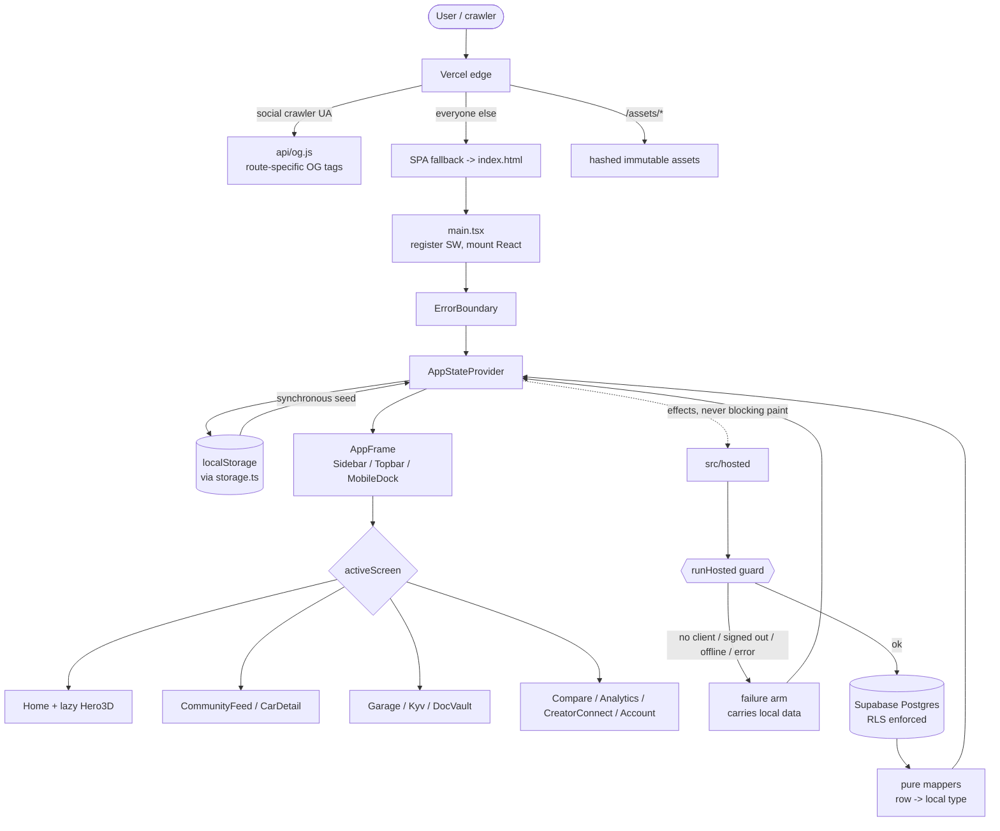
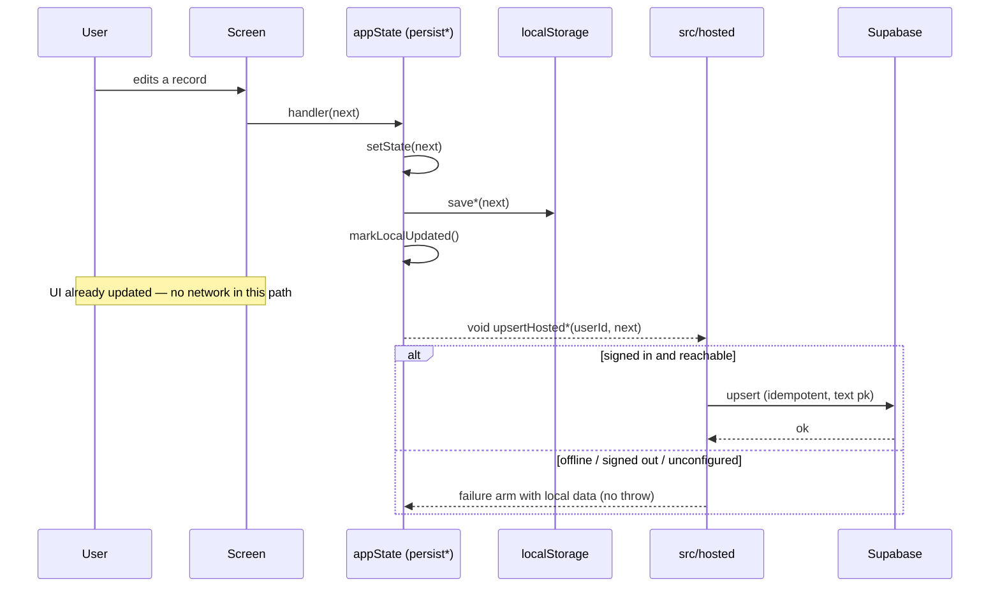
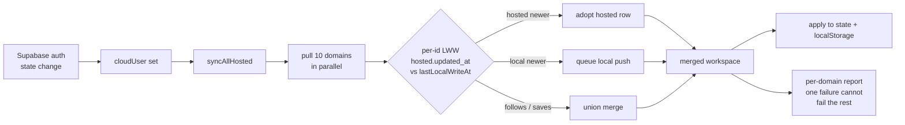

# AutoFlex engineering notes

Why this codebase looks the way it does: the decisions taken, the reasoning
behind them, the libraries chosen, the agents that did the work, and how
execution actually travels through the app.

Written against commit `5a31b3b`. Production: https://moto-gp-chi.vercel.app

---

## 1. Decisions

Each entry records what was decided, why, and what was given up. Decisions are
grouped by area; within a group they are roughly chronological.

### 1.1 Design system and shell

**D1 — Full redesign onto "Obsidian Velocity" rather than a restyle.**
The Stitch template supplied complete per-screen HTML mockups, not just a
palette. A colour-swap would have left the old light-theme information
hierarchy underneath and matched none of the template pages. Full rebuild was
chosen, keeping all behaviour and tests intact.
*Trade-off:* far larger diff (189 files) and a much higher regression risk,
which is why the QA phase was mandatory rather than optional.

**D2 — Material-3-style token names in Tailwind config, not raw hex.**
The template's `DESIGN.md` already expressed itself as M3 roles
(`surface-container-high`, `on-surface-variant`, `outline-variant`). Encoding
those names in `tailwind.config.js` means screens read as intent
(`bg-surface-container border-outline-variant`) instead of arbitrary colour,
and a future palette change is one file.

**D3 — Two typefaces with distinct jobs.** Space Grotesk for display and prose,
JetBrains Mono for data and labels. In an ownership product almost every screen
mixes editorial text with figures — registration numbers, odometer readings,
prices, expiry dates. A monospace column keeps digits aligned and signals
"this is data" without extra chrome. The recurring `label-caps` convention
(`font-mono text-[10px] font-bold tracking-[0.2em] uppercase`) came from the
template and was kept as a single class.

**D4 — `App.tsx` split from 2,323 lines into per-screen modules.**
The monolith made parallel agent work impossible — every agent would have
collided in one file. Splitting into `src/app/screens/*` with all logic hoisted
into `src/app/state/appState.tsx` created clean ownership boundaries.
*Consequence:* `appState.tsx` is now the single large file (~1,200 lines). That
is deliberate: one hub with clear seams beats state scattered across ten
screens.

**D5 — A discovery, not a decision: the real app was orphaned.**
`main.tsx` was rendering a throwaway prototype (`PremiumAutoflex.tsx`) while the
full 2,323-line `App.tsx` sat unrouted. Restoring the real app as the entry
point was a prerequisite for everything else; the prototype was later deleted.

### 1.2 Data

**D6 — A frozen contract file (`src/core/catalog/carData.ts`) written before the data existed.**
The catalog was needed by three screen agents and one data agent working
simultaneously. Publishing the types and function signatures first, with a seed
row, let all four start immediately without waiting or colliding.
*This is the single highest-leverage decision in the project* — it converted a
serial dependency into a parallel one.

**D7 — On-road price as a per-state multiplier, not a stored price matrix.**
Real on-road price is ex-showroom + RTO + insurance + cess, and every one of
those varies by state, variant and buyer. Storing a full matrix would be
thousands of rows that go stale instantly. A single `stateOnRoadFactor` per
state applied to ex-showroom is honest about being an estimate, stays
maintainable, and is one number to correct per state.
*Trade-off:* not exact for any individual buyer. Acceptable for comparison,
which is the actual job.

**D8 — Real researched market data over plausible-looking placeholders.**
Prices, variants, power/torque and ARAI figures were researched from
manufacturer sites, CarWale, ZigWheels, Autocar India and V3Cars, and the data
vintage is recorded in the file header. An automotive audience detects wrong
numbers instantly, and wrong numbers destroy trust in the compare engine, which
is a core PRD feature.

**D9 — Demo-derived values are deterministic and labelled.**
KYV and Doc Vault need RC status, challans and expiry dates that no API
supplies yet. Those are derived from a hash of the vehicle record, never
`Math.random()`, so they stay stable across renders, and the UI says so.
*Why it matters:* a user who believes fabricated document data is their real
record is a genuine harm. This is an explicit stop rule in the tester script.

### 1.3 Persistence

**D10 — Local-first is the invariant, hosting is an enhancement.**
The app must work with no network, no session, and no Supabase configuration.
Every hosted call therefore returns a result object that carries usable `data`
on *both* the success and failure arms:

```ts
type HostedResult<D> =
  | { ok: true;  source: "hosted"; data: D }
  | { ok: false; source: "local";  data: D; reason: HostedFailureReason; message: string }
```

Callers write `setPosts(result.data)` with no branching. `ok` is consulted only
to decide whether to show status copy.

**D11 — Nothing in `src/infrastructure/hosted/` throws.** Two guards (`runHosted`,
`runHostedForUser`) convert a null client, a signed-out user, an offline
browser and any thrown PostgREST error into the failure arm. A rejected promise
inside a render path is how local-first apps become blank screens; making it
structurally impossible was preferred to catching it case by case.

**D12 — Write local first, then mirror.** Every mutation funnels through
`persist*` in `appState.tsx`: set state, write `localStorage`, then
fire-and-forget the hosted write. The UI never waits on the network to feel
responsive, and a failed sync costs nothing.

**D13 — Last-write-wins keyed on an explicit local timestamp.**
`syncAllHosted` merges by comparing each hosted row's `updated_at` against a
persisted `lastLocalWriteAt`. Without that marker, hosted rows would silently
beat edits made while offline. Simple LWW was chosen over CRDTs because the
data is single-user-per-account; the complexity is not earned.

**D14 — Additive merges for follows and saves.** These merge as unions rather
than LWW. Silently un-following something the user chose is a worse failure
than keeping a stale follow.

**D15 — Pure mappers separated from IO.** Row⇄local conversion lives in
mapper modules with no client import, so round-trips, coercion and unknown-enum
handling are unit-testable without a network. Unknown hosted enum values
collapse to a safe local default instead of widening a union type.

**D16 — Per-domain isolation in the orchestrator.** Each of the ten domains
syncs in its own try/catch. One failing domain reports `failed` while the other
nine still complete, instead of one bad row killing the whole sync.

**D17 — Text primary keys matching local ids.** Hosted tables key on the app's
existing string ids, which makes every upsert idempotent and re-syncing safe.

**D18 — A device "cloud owner" guard.** The device records which account its
data belongs to, so one account's hosted backup cannot silently overwrite
another's on a shared machine.

**D19 — RLS on every table, owner-scoped by default.** Only `city_circles`,
`model_playbooks`, `playbook_entries` and `post_quality_scores` are public-read
— they are community content. Each migration explicitly revokes from `anon`
before granting, so Postgres default privileges cannot leak write access.

**D20 — Auth stayed in `cloudSync.ts`.** Sign-in links, sign-out and the backup
snapshot are Supabase *auth* concerns, not data-access concerns. Only
`communityApi.ts` was retired, because the hosted layer fully superseded it.

### 1.4 Sharing and previews

**D21 — Deep links derived from the route table, never string-concatenated.**
`src/app/sharing/share.ts` spreads `workspacePaths`/`accountPaths` from `routing.ts`, so a
route rename cannot leave shared links pointing at dead paths.

**D22 — Share degrades down a ladder and distinguishes cancel from failure.**
Web Share → clipboard → `execCommand` → `prompt`. The previous implementation
reported "cancelled or blocked" when a user simply tapped Cancel, which reads
as an error for a deliberate action.

**D23 — Per-route Open Graph via a crawler-only serverless shim.**
A static SPA serves one `index.html` to everyone, so per-post previews need
server help. Options were SSR (rewrites the whole app), prerendering (stale for
user content), or a shim. The shim was chosen: `vercel.json` rewrites *only*
social-crawler user agents to `api/og.js`, ahead of the SPA catch-all. Humans
are untouched.

**D24 — Search engines deliberately excluded from the shim.** Googlebot and
bingbot match nothing and get the real SPA, so indexing reflects the actual app
rather than a metadata stub.

**D25 — No inline script or style anywhere in the OG document.** The CSP ships
`script-src 'self'` and `style-src 'self'` with no `unsafe-inline`. The
redirect is therefore a `<meta http-equiv="refresh">`, not JavaScript. The
strict CSP was treated as a constraint to design within, never to relax.

**D26 — Canonical points at the indexable production domain.**
Vercel serves the `…-git-master-…` branch alias with `x-robots-tag: noindex`.
Canonical and `og:url` originally pointed there — telling crawlers the
shareable URL was unindexable. Both now point at `moto-gp-chi.vercel.app`, and
a test fails if `index.html` and `defaultShareOrigin` ever drift apart.

### 1.5 Rendering and performance

**D27 — The Three.js hero is lazily imported.** It is 121 kB gzipped, larger
than the rest of the app. `lazy()` + `Suspense` keeps it out of the initial
bundle entirely, so first paint never pays for it.

**D28 — The 3D scene is defensive by construction.** Full disposal on unmount
(geometries, materials, renderer, listeners, observers), a static frame under
`prefers-reduced-motion`, the animation loop gated by `visibilitychange` and
`IntersectionObserver`, `devicePixelRatio` capped at 2, and a styled fallback
when WebGL is unavailable. A decorative hero must never be why a phone gets hot
or a page crashes.

**D29 — Charts drawn with CSS and inline SVG, no charting library.** The
analytics screen needs bars and sparklines. A chart library would add tens of
kilobytes and its own theming layer to fight with the design tokens.

### 1.6 Correctness fixes found during deployed QA

**D30 — `cleanUrls` removed from `vercel.json`.** With `cleanUrls: true`,
Vercel injects a `.html` → clean-path 308 *ahead of* the filesystem handler.
The SPA fallback rewrites to `/index.html` with `check: true`, which re-enters
routing and hits that redirect — so every route except `/` returned 404 in
production. Proven by compiling the config with Vercel's own
`@vercel/routing-utils`, not by guesswork. A regression test now fails if a
`.html` fallback and `cleanUrls` ever coexist.

**D31 — The service worker is now actually registered.** The build emitted
`sw.js` with 64 precached URLs and printed a success line, but nothing called
`register()`. There was no offline shell and no install eligibility.
Registration runs after `load`, production-only, and a failure is non-fatal.

**D32 — `ErrorBoundary` wraps the provider, not just the frame.** Storage reads
and route parsing happen inside `AppStateProvider`, so a crash there previously
produced an empty `<div id="root">`.

**D33 — Storage parsing shape-checks against its fallback.** Valid JSON of the
wrong shape (a string stored under a list key) reached `.map()` and blanked the
page. Parsing now verifies the parsed value matches the fallback's shape.

### 1.7 Process

**D34 — Contract-first parallelism.** Agents ran in parallel only where file
ownership was disjoint; anything touching `appState.tsx` ran sequentially.
Shared surfaces (`carData.ts`, `HostedResult`, `Hero3D`'s zero-prop default
export) were frozen in advance so parallel agents could compile against them.

**D35 — Isolated build sandboxes per agent.** Each parallel agent got its own
build directory with a hard-linked `node_modules`, so one agent's broken
intermediate state could not fail another's test run.

**D36 — Push after every phase.** A sandbox reset destroyed a completed phase
that had been committed locally but never pushed. Work is now pushed to GitHub
and mirrored to the user's disk at every checkpoint. The schema survived only
because DDL had been applied to the live database; the migration files had to
be reconstructed from the Postgres catalog.

**D37 — Gated items left undone on purpose.** Google sign-in, native Android
parity, service-center integration and real-user tester sessions are all
blocked on conditions that have not been met. Building them now would be
building on assumptions. The tester-session script is written and ready; it
needs recruited humans.

---

## 2. Library choices

| Library | Why it is here | What was rejected, and why |
| --- | --- | --- |
| **React 19** | Already the app's framework; no reason to churn. | — |
| **Vite 6** | Existing toolchain. Fast HMR, native ESM, first-class code-splitting — which D27 depends on. | — |
| **TypeScript 5.7** | The hosted layer's whole safety story is types: `HostedResult`, generated DB types, unions for enums. Mappers are only trustworthy because the compiler checks both directions. | — |
| **react-router-dom 7** | Deep-linkable routes were already a product requirement (`/community/:postId`, and now `/cars`, `/playbooks`, `/cities`). | Hash routing — worse for sharing and for OG previews. |
| **Tailwind 3** | Token-driven design system (D2) maps directly onto config-driven utilities. Screens stay self-describing and no separate stylesheet drifts out of sync. | CSS-in-JS: extra runtime, and inline styles would violate the strict CSP (D25). |
| **@supabase/supabase-js 2** | Postgres + RLS + auth in one. RLS is what makes owner-scoped data safe with only a publishable key in the browser (D19). | A bespoke API server — the repo has a Fastify path, but it needs hosting, auth and its own security review for no near-term gain. |
| **three 0.170** | The template's hero is a genuine 3D scene. Three.js is the standard, and lazy-loading contains its cost (D27). | react-three-fiber: another abstraction on top for one component. CSS-only: would not match the template. |
| **lucide-react** | Consistent stroke icons matching the template's thin-line aesthetic; tree-shakeable per-icon imports. | Icon fonts — extra network round trip and worse a11y. |
| **@fontsource/space-grotesk, @fontsource/jetbrains-mono** | Self-hosted fonts. The CSP has `font-src 'self'`, so a CDN font would be blocked; self-hosting also avoids a third-party request on first paint. | Google Fonts CDN — CSP violation and a privacy hop. |
| **vitest 4** | Shares Vite's transform pipeline, so tests run against the same module graph as the build. 231 tests run in ~2s, which is what makes test-after-every-change viable. | Jest — separate transform config for the same code. |
| **fastify + @fastify/cors** | Pre-existing TypeScript API path, retained for the moderation/feedback queues. Not on the web MVP's critical path. | — |
| **tailwindcss / postcss / autoprefixer** (dev) | Build-time only. | — |
| **No chart library** | See D29. | recharts / chart.js — kilobytes and theming friction for bars and sparklines. |
| **No date library** | ISO strings in, `Intl` for formatting; the coercion helpers handle the rest. | date-fns / dayjs — unnecessary weight for the handful of operations needed. |
| **No state-management library** | One `useApp()` context over `useState` is sufficient for a single-user, local-first app. | Redux / Zustand — ceremony without a problem to solve. |

Deliberately zero runtime dependencies were added for: the OG image (generated
by a script with a hand-rolled PNG encoder), the OG shim (`api/og.js` uses only
`fetch`), and the service worker (a build script, not Workbox).

---

## 3. Agents that did the work

Fourteen agent runs across five phases. Parallel agents were given disjoint file
ownership; anything touching `appState.tsx` ran alone.

### Phase 1 — Foundation (sequential)

| Agent | Owned | Delivered |
| --- | --- | --- |
| Design foundation | `tailwind.config.js`, `styles.css`, `index.html`, `main.tsx`, shell, `ui.tsx` | Obsidian Velocity tokens, font swap, app shell, and the `App.tsx` → `appState.tsx` + `screens/*` split that made everything after it parallelisable. Found the orphaned-app bug (D5). |

### Phase 2 — Screens and data (five in parallel)

| Agent | Owned | Delivered |
| --- | --- | --- |
| Screen agent B | `Home`, `CommunityFeed`, `CarDetail` | Hero + telemetry grid, Team-BHP-style feed, spec sheet with state-wise pricing matrix. |
| Screen agent C | `Garage`, `Kyv`, `DocVault` | Fleet split view, RC/compliance dashboard, document vault with validity chips. |
| Screen agent D | `Compare`, `Analytics`, `CreatorConnect`, `Account` | CarDekho-style compare engine with best-in-row highlighting, funnel dashboard, creator hub. |
| 3D hero agent | `components/Hero3D.tsx` | Three.js scene with the full defensive envelope (D28). |
| Data agent | `carData.ts`, `vehicleCatalog.ts` + tests | 37 models / 127 variants of researched Indian market data (D8). |

### Phase 3 — QA

| Agent | Delivered |
| --- | --- |
| QA agent | Ran tests + build, deleted the dead prototype and transitional CSS, verified 19 screenshots. Caught doubled hero text and unreachable mobile routes. |

### Phase 4 — Hosted persistence (two in parallel, then one)

| Agent | Owned | Delivered |
| --- | --- | --- |
| Schema agent | Supabase DDL, migrations, `database.types.ts` | 12 new tables with RLS, indexes, triggers and comments; zero security-advisor lints. |
| Hosted API agent | `src/infrastructure/hosted/**` | 16 modules, the `HostedResult` convention, pure mappers, `syncAllHosted`. Rebuilt from scratch after the sandbox loss, reconstructing migrations from the live catalog. |
| Deep links / OG agent | `share.ts`, `api/og.js`, `vercel.json`, `index.html`, docs | Canonical deep links, crawler-gated OG shim, generated OG card, launch panel and tester kit. |
| Wiring agent | `appState.tsx`, `screens/*`, `routing.ts` | Wired the app to the hosted layer. Hit a session limit mid-migration; the remaining call sites were finished by hand. |

### Phase 5 — Deployed QA

| Agent | Delivered |
| --- | --- |
| Deployed QA agent | 72 route×width screenshots, header/manifest/OG verification, offline and corrupt-storage testing. Found the production 404 (D30), the unregistered service worker (D31), dead deep links, and the unmounted error boundary (D32). |

**What worked:** freezing contracts before parallel work; one owner per file;
isolated build sandboxes; a QA agent that treats the repo's own checklist as
the spec rather than inventing one.

**What did not:** trusting local commits without pushing (D36); giving one
agent a task large enough to hit a session limit; assuming a green local build
means a working deployment — the 404 existed for hours behind passing tests.

---

## 4. How execution travels

### 4.1 Boot

```
index.html
  └─ /assets/index-*.js
       └─ src/main.tsx
            ├─ font CSS imports (self-hosted)
            ├─ registerServiceWorker()      // prod only, after `load`, non-fatal
            └─ createRoot().render(
                 <StrictMode>
                   <BrowserRouter>          // history + location
                     <App />
```

`src/app/App.tsx` composes the tree deliberately:

```
<ErrorBoundary>          // outermost: storage reads and route parsing can crash
  <AppStateProvider>     // all state, effects, storage, sync
    <AppFrame>           // Sidebar + Topbar + <main> + MobileDock
      {activeScreen === "…" ? <Screen/> : null}
```

`AppFrame` picks one of ten screens from `activeScreen`. Screens hold no state
of their own beyond local UI concerns; they call `useApp()`.

### 4.2 First paint is always local

`AppStateProvider` initialises every slice synchronously from `localStorage`
via `src/infrastructure/storage/localStore.ts` (seeded defaults on first run). **The first render never
waits on the network.** Hosted data merges in later, if and when it arrives.

### 4.3 A read

```
Screen → useApp() → state (already local)
                 ↘ effect → hosted list*() → HostedResult
                                            ├─ ok:true  → merge hosted into state + storage
                                            └─ ok:false → keep local; data is still present
```

### 4.4 A write

```
User event → handler in appState.tsx
                └─ persist*(next)
                     ├─ setState(next)                    // UI updates immediately
                     ├─ save*(next)                       // localStorage
                     └─ noteLocalWrite(push)
                          ├─ markLocalUpdated()           // lastLocalWriteAt (D13)
                          └─ if signed in: void upsertHosted*(userId, next)   // fire-and-forget
```

The hosted call cannot throw and is never awaited, so the interaction feels
identical online, offline, or signed out.

### 4.5 Sign-in and full sync

```
Supabase auth state change
  └─ cloudUser set
       └─ syncAllHosted(userId, snapshot, { localUpdatedAt })
            ├─ pull all 10 domains in parallel
            ├─ per-id LWW merge (hosted.updated_at vs lastLocalWriteAt)
            │    └─ follows + saves merge as unions (D14)
            ├─ push the ids local won  (vehicles before timeline: FK order)
            └─ → { workspace, reports, syncedAt }
                 └─ applied to state + localStorage; failures surface as copy
```

### 4.6 Routing

URL is the source of truth. `routeFromPath()` maps a pathname to
`{ screen, nav, accountView?, detailType?, detailSlug? }`; an effect syncs
`activeScreen` from `location`, and navigation calls `navigate()` rather than
mutating state directly — so Back/Forward, refresh and shared links all behave.

### 4.7 Crawler vs human

```
GET /cars/hyundai-creta
   ├─ social crawler UA  → vercel.json rewrite → api/og.js
   │                          → route-specific OG tags + meta-refresh to ?og=0
   └─ anyone else        → SPA fallback → /index.html → React → detail route
```

### 4.8 Offline

The service worker precaches 64 URLs and falls back to the cached shell for
navigations. Combined with local-first state, a cold reload with no network
still renders the workspace.

### 4.9 Diagram — request to render



### 4.10 Diagram — a write



### 4.11 Diagram — sign-in sync



---

## 5. Map of the codebase

```
src/
  main.tsx            entry: fonts, service worker, React root
  App.tsx             ErrorBoundary > AppStateProvider > shell > screen switch
  appState.tsx        ALL state, effects, handlers, persist funnel, sync  ← the hub
  storage.ts          localStorage read/write with shape-checked parsing
  routing.ts          path <-> {screen, accountView, detailType, detailSlug}
  domain.ts           core types (OwnerPost, GarageVehicle, TimelineEntry…)
  insights.ts         derived views (playbooks, city circles, checklists, reminders, quality)
  carData.ts          frozen contract + researched Indian market catalog
  share.ts            deep links + share ladder
  supabase.ts         client factory (returns null when unconfigured)
  database.types.ts   generated from the live schema
  cloudSync.ts        auth + backup snapshot (deliberately separate from hosted/)
  hosted/             local-first data-access layer
    result.ts           HostedResult, runHosted, runHostedForUser
    coerce.ts           total coercion helpers
    *.ts                one module per domain
    syncAll.ts          LWW orchestrator
  components/         Shell.tsx, ui.tsx, Hero3D.tsx (lazy)
  screens/            ten screen modules
api/og.js             crawler-only Open Graph shim
scripts/              service worker + OG image generators
supabase/migrations/  schema, reconstructed to match the live database
```

**Reading order for someone new:** `App.tsx` → `appState.tsx` (the persist
funnel around `persist*`/`noteLocalWrite`) → `hosted/result.ts` (the whole
error philosophy in ~130 lines) → one screen → `routing.ts`.

---

## 6. Known gaps

- A fresh visitor starts with a seeded demo garage. This is why the first-run
  path needed a workaround, and it is a product decision to confirm.
- KYV and Doc Vault expiry data is deterministic demo data until real RC and
  document APIs exist.
- Single-line truncation in some compact tiles at 360px; layout holds, but text
  is elided.
- Real crawler unfurls, the install prompt, Web Share sheet behaviour and
  slow-network performance need a human on a real device.
- Production ops items — admin token rotation, `/api/health`, backup-restore
  drill — need the Fastify API running with shared-environment secrets.
