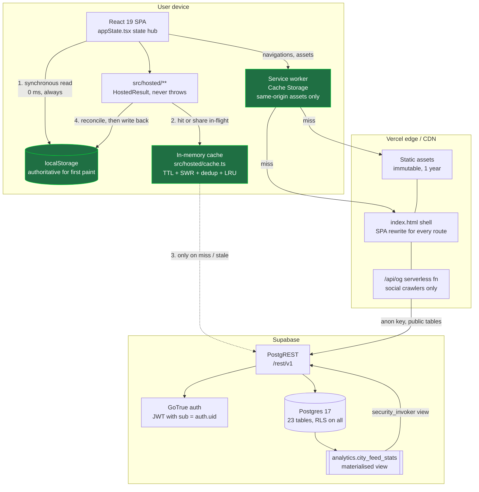
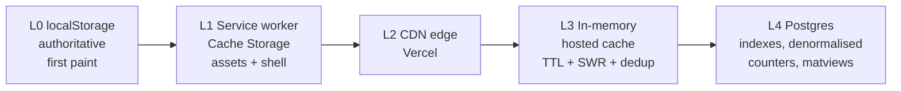

# AutoFlex system architecture

Written against the live schema of Supabase project `uxzdmlqyxausmmdpmkrr` (23
tables, RLS on every one) and the code at `master`. Every schema claim below was
produced by querying `pg_policy`, `pg_indexes` and `information_schema`, not by
reading migrations.

Companion documents: `PERFORMANCE_AUDIT.md` (what was measured and fixed),
`HOSTED_BACKEND_DECISION.md` (why Supabase).

---

## 1. The property that decides everything

AutoFlex is **local-first**. The first paint reads `localStorage` synchronously
and renders a complete, usable app before a single network request is issued.
The network is a *background reconciliation*, not a dependency.

Two consequences run through every decision in this document:

1. **The database is not on the critical path for a read.** So the interesting
   scaling question is not "how fast is the query" but "how few queries can we
   get away with, and how cheap is each one when it does run".
2. **Failure is an ordinary state.** `src/hosted/**` returns a
   `HostedResult<T>` that carries usable `data` on *both* arms. Offline,
   signed-out and unconfigured are not error paths. Nothing in that directory
   throws into a render. Any new layer — including the cache added in this
   change — must preserve that or it is a regression, however fast it is.

If a future change makes first paint wait on the network, it has removed the
single largest scaling asset this product has.

---

## 2. System architecture



**Where each responsibility lives, and why there.**

| Responsibility | Lives in | Why not elsewhere |
| --- | --- | --- |
| First paint | `localStorage` + React | Any network hop here costs a second on a 3G Indian connection |
| Authorisation | Postgres RLS | One enforcement point. A second one in an API layer would drift |
| Request collapsing, TTL, SWR | `src/hosted/cache.ts` | Per-tab; the only layer that knows a user just navigated back |
| Asset delivery | Vercel CDN, content-hashed | Immutable filenames make a 1-year TTL trivially correct |
| Offline shell | Service worker | Only layer that can answer a navigation with no network |
| Expensive aggregates | Postgres materialised view | Aggregates over *all* users cannot be computed from one client's local data |
| Social previews | `/api/og` serverless | Crawlers do not run JavaScript; the SPA shell alone previews as "AutoFlex" |

The service worker's `fetch` handler returns early for anything where
`url.origin !== self.location.origin`. Supabase is a different origin, so
**PostgREST responses are structurally excluded from Cache Storage**. That is
not a convention someone could forget — it is the shape of the handler, and it
is the reason no RLS-scoped row can end up in a shared on-disk cache.

---

## 3. Component structure and data flow

### Journey A — cold first paint, signed out

| Hop | Served from | Cost |
| --- | --- | --- |
| 1. `GET /` | CDN edge, or SW `/index.html` if previously installed | ~30 ms edge, ~0 ms SW |
| 2. `GET /assets/index-*.js` | CDN, `max-age=31536000, immutable`; SW Cache Storage after first visit | 0 ms on repeat |
| 3. Hydrate `appState` | `localStorage`, synchronous | 0 ms, no await |
| 4. **Screen is interactive** | — | Nothing above touched Postgres |
| 5. Background `listHostedPostsPage()` | in-memory cache miss → PostgREST | one index-only scan, `limit + 1` rows |
| 6. Background `listHostedCityCircles()`, `listHostedPlaybooks()`, `listHostedPostQuality()` | in-memory cache; on a warm tab, zero requests | — |
| 7. Merge and persist | `localStorage`, coalesced to one write per frame | — |

Steps 5 and 6 fire concurrently from `appState`'s mount effect. Before this
change, a remount re-issued all of them; they are now deduplicated per key and
TTL'd, so a back-navigation inside the fresh window costs **zero requests**.

### Journey B — authenticated sync

`syncAllHosted()` fans out across ten domains, each `runHostedForUser`-guarded.

| Hop | Served from | Notes |
| --- | --- | --- |
| 1. JWT attached by supabase-js | in-memory session, refreshed by GoTrue | |
| 2. Ten scoped `select`s | **origin only, never cached** | every one of these tables is owner-scoped under RLS |
| 3. RLS filter | Postgres | `(select auth.uid()) = user_id`, evaluated once per query |
| 4. Merge | pure functions in `syncAll.ts` | last-write-wins per key on `updated_at` |
| 5. Write-back | `localStorage` + upserts | |

**Nothing in this journey is cached, by design.** The cache refuses to store an
owner-scoped read unless the key is minted by `ownerKey(userId, ...)`, and no
call site does that today. Sync is infrequent, correctness-critical, and the
downside of a wrong answer — showing another account's garage — is
catastrophic rather than merely slow. The cache is not the right tool.

### Journey C — feed page fetch

```
listHostedPostsPage({ sort, cursor, limit })
  └─ key = public:feed:recent|30|<cursor>
       ├─ fresh  (< 30 s)  → return cached page, 0 requests
       ├─ stale  (< 5 min) → return cached page NOW + one background refresh
       └─ expired / miss   → one deduplicated PostgREST request
             GET /rest/v1/owner_posts
               ?select=<19 columns>&order=created_at.desc,id.desc&limit=31
               [&or=(created_at.lt.<v>,and(created_at.eq.<v>,id.lt.<id>))]
```

The cursor is `(ordering value, primary key)` and the query is served by
`owner_posts_created_at_id_idx` / `owner_posts_ranking_score_id_idx` as an
index-only scan — constant cost at any page depth. Comment *bodies* are never
fetched here; `comment_count` is denormalised onto `owner_posts` by trigger and
bodies load when a post is opened.

The key pins `(sort, limit, cursor)`, so page 2 can never be served as page 1,
and a `ranked` feed can never be served to a `recent` request.

---

## 4. API design

### Should PostgREST stay?

**Yes, for now — and that is the interesting answer, not a default one.**

What PostgREST is genuinely buying today:

- **One authorisation model.** RLS is the only place authz is decided. An API
  layer in front does not remove RLS, it *adds* a second place where a rule can
  be wrong, and the two will drift.
- **No cold starts, no extra hop.** A serverless API in front of Postgres adds
  a network leg and a lambda cold start to a request the client already treats
  as optional background work.
- **Nothing to operate.** At this stage engineering time is the scarcest
  resource in the system.

What it is costing:

- **Zero rate limiting.** Anyone with the publishable key — which ships in the
  bundle, as it must — can issue unlimited reads and, once signed in, unlimited
  writes. RLS answers *whose* row this is. It has no opinion on *how many*.
- **Schema is the public contract.** Renaming `owner_posts.helpful` is a
  breaking API change for every installed PWA, including ones that will not
  update for weeks.
- **No server-side aggregates.** The client computes city circles and playbook
  confidence from whatever slice of posts it happens to hold, which makes those
  numbers a sample rather than a count. (Section 7 fixes the city case.)
- **No place to hold a secret**, so no payments, no SMS, no service-centre
  integrations.

### Decision criteria — introduce the boundary when any two are true

| # | Criterion | Measurable trigger |
| --- | --- | --- |
| 1 | **Abuse control** | First spam wave, or any single IP/user exceeding ~600 reads or ~60 writes per minute sustained. This is the criterion most likely to fire first |
| 2 | **Aggregate queries** | A screen needs a cross-user aggregate that cannot be a *public* materialised view — i.e. it mixes RLS-protected rows |
| 3 | **Schema coupling** | More than one client release in a quarter is blocked on, or forced by, a column rename. Track it; do not estimate it |
| 4 | **Secrets** | The first feature needing a credential the browser must not hold |
| 5 | **Aggregate write cost** | Writes needing multi-table transactional invariants that RLS and constraints cannot express |

Explicitly **not** reasons: "PostgREST feels like a leaky abstraction"; wanting
REST aesthetics; a preference for the unused `server-ts/` Fastify app. Each of
those buys latency and a second authz surface in exchange for taste.

**The stopgap for criterion 1, before any API exists.** Rate limiting can be
enforced inside Postgres — a `write_budget(user_id, window_start, count)` table
plus a `before insert` trigger on `owner_posts` and `post_comments` that raises
when the count exceeds the budget. It is ugly, it costs a row lock per write,
and it cannot rate-limit *reads* at all. But it is the only enforcement point a
browser cannot go around while the browser talks to Postgres directly. **Not
implemented here** — the limits are a product decision, not an engineering one.

### The API surface, if and when

Sitting at `api.autoflex.app`, with RLS still enforced underneath — the service
never uses the service-role key for a user-scoped read.

```
Versioning     /v1/...  Additive-only within a major. Breaking change = /v2,
                        both live for 6 months, `Sunset` + `Deprecation` headers
                        on v1 from day one of v2.

Public reads   GET  /v1/feed?sort=recent|ranked&cursor=&limit=
               GET  /v1/posts/{id}
               GET  /v1/posts/{id}/comments?cursor=&limit=
               GET  /v1/cities                     GET /v1/cities/{slug}
               GET  /v1/playbooks                  GET /v1/playbooks/{id}

Owner-scoped   GET|PUT    /v1/me/profile
               GET|POST   /v1/me/garage            /v1/me/garage/{id}
               GET|POST   /v1/me/timeline  /v1/me/shortlist  /v1/me/inspections
               POST       /v1/me/sync              full reconcile, idempotent

Writes         POST /v1/posts, POST /v1/posts/{id}/comments, POST /v1/reports
               All mutations accept `Idempotency-Key`; a replay inside 24 h
               returns the original response, so a retry on a flaky mobile
               connection cannot double-post.
```

**Pagination.** Opaque forward cursors only. `?page=` and `?offset=` are never
added, because their cost grows with depth and the client would come to depend
on stable page numbers that a live feed cannot provide.

```json
{
  "data": [ ... ],
  "page": { "next_cursor": "MjAyNi0wOC0yMVQxMDowMDowMFp8cG9zdC05", "has_more": true }
}
```

**Errors.** RFC 9457 `application/problem+json`, plus a stable machine `code`
the client switches on — HTTP status alone is too coarse.

```json
{
  "type": "https://autoflex.app/errors/rate-limited",
  "title": "Too many posts",
  "status": 429,
  "code": "rate_limited",
  "detail": "You can publish 10 posts an hour. Try again in 12 minutes.",
  "instance": "/v1/posts",
  "retry_after_seconds": 720
}
```

`4xx` means "your request was wrong", `5xx` means "we were wrong". The hosted
layer maps every non-2xx onto the existing `HostedFailureReason` union, so
introducing the API changes nothing above `src/hosted/**`.

**Rate limits.** Token bucket keyed on user id, falling back to IP for anon.
`RateLimit-Limit` / `RateLimit-Remaining` / `RateLimit-Reset` on every response,
`Retry-After` on 429. `server-ts/security.ts` already contains a working
in-memory limiter and a constant-time admin-token comparison; that is the
starting point, with the store moved to Redis once there is more than one
instance.

---

## 5. Database schema

23 tables, RLS enabled on all 23. **Six are anon-readable; seventeen are
strictly owner-scoped** under `(select auth.uid()) = user_id` — the form
Postgres evaluates once per query rather than once per row.

### Identity — 4 tables

| Table | Key | Reads | Notes |
| --- | --- | --- | --- |
| `profiles` | `user_id` | owner | display name, city, garage role |
| `follows` | `user_id` | owner | `models[]` / `topics[]` arrays, one row per user |
| `subscription_settings` | `user_id` | owner | digest / alerts / quiet hours |
| `autoflex_user_backups` | `user_id` | owner | **whole-workspace `jsonb` snapshot** |

`autoflex_user_backups` is the single worst-behaved table in the schema. One row
per user, but the row is a full serialisation of the workspace rewritten on
every change. Its own comment concedes the normalised tables are authoritative.
At 1M users with a 200 KB payload that is 200 GB of TOAST, almost all of it dead
tuples between vacuums, to store data that already exists elsewhere. **Retire
it**; if disaster recovery genuinely needs a snapshot, write it to object
storage on a schedule, not to the OLTP primary on every keystroke.

### Community — 6 tables (the public surface)

| Table | Anon read | Indexes that matter |
| --- | --- | --- |
| `owner_posts` | **yes** | `(created_at desc, id desc)`, `(ranking_score desc, id desc)`, `(brand, model)` |
| `post_comments` | **yes** | `(post_id, created_at)` |
| `post_quality_scores` | **yes** | `(ranking_score desc, computed_at desc)`, `(grade, score desc)` |
| `saved_posts` | no | pk `(user_id, post_id)` |
| `reports` | no | `(user_id, created_at desc)` |
| `city_follows` | no | `(user_id, created_at desc)`, `(city_slug)` |

`owner_posts` carries denormalised `comment_count`, `quality_score`,
`quality_grade`, `ranking_score`, `last_ranked_at`, so a feed card renders from
one table.

### Garage / ownership — 4 tables

`garage_vehicles`, `timeline_entries`, `garage_costs`, `garage_reminders`. All
owner-private, all indexed with `user_id` leading, so one user's volume is
independent of everyone else's. `garage_vehicles`, `timeline_entries` and
`shortlist_items` carry `deleted_at` for soft deletes.

### Buying — 3 tables

`shortlist_items`, `inspection_sessions`, `inspection_items`. Owner-private.
`inspection_sessions` also carries `(brand, model)` — the index exists for a
future cross-user "what do inspections find on this model" aggregate that **does
not exist yet and cannot be built as a public view**, because the source rows are
RLS-protected. That is decision criterion 2 waiting to fire.

### Content and signals — 4 tables

| Table | Anon read | Written by |
| --- | --- | --- |
| `city_circles` | **yes** | any signed-in user, `curated_by` |
| `model_playbooks` | **yes** | any signed-in user, `curated_by` |
| `playbook_entries` | **yes** | contributors |
| `feedback_entries` | no | owner only |

`city_circles` and `model_playbooks` are **world-readable and writable by any
signed-in account**. That is fine at community scale and is an open moderation
hole at internet scale: one account can rewrite the Pune page for everyone. The
fix is a `curator` role check in the `update` policy, not more caching.

### Ops — 2 tables

`notification_jobs`, `notification_deliveries`. Append-only, time-series, and
the fastest-growing tables in the system by an order of magnitude.

### Growth and hot tables

Assumptions stated so they can be argued with: 1.3 vehicles per active user,
20 timeline entries per vehicle per year, 2% of users post weekly, 6 comments
per post, one digest per user per week.

| Table | Rows at 1M users | Growth | Hot? |
| --- | --- | --- | --- |
| `notification_deliveries` | ~100 M / year | fastest by 2 orders | write-hot |
| `notification_jobs` | ~52 M / year | fastest | write-hot |
| `timeline_entries` | ~26 M / year | fast | write-warm |
| `garage_costs` | ~26 M / year | mirrors timeline | write-warm |
| `post_comments` | ~6 M / year | moderate | read+write hot |
| `owner_posts` | ~1 M / year | moderate | **read-hot: every visitor** |
| `post_quality_scores` | 1 per post | tracks posts | read-hot |
| `autoflex_user_backups` | 1 M rows, ~200 GB | per-user churn | write-hot, bloat |
| everything else | ≤ a few M | slow | cold |

### What needs partitioning, first and on what key

1. **`notification_deliveries`** — `RANGE (delivered_at)`, monthly. Append-only,
   queried by recency, and the only table where `DROP PARTITION` gives free
   retention. Do this first: it is the highest-volume table and the easiest win.
2. **`notification_jobs`** — `RANGE (scheduled_for)`, monthly. The worker
   queries `status = 'Queued' and scheduled_for <= now()`, which prunes to one
   or two partitions.
3. **`post_comments`** — `HASH (post_id)`, 16 ways. Note the key: comments are
   *only ever* read as "all comments for this post", so hashing on `post_id`
   keeps a post's thread inside one partition. Range-partitioning by
   `created_at` would be wrong here — it spreads one thread across every
   partition and turns a single index scan into a fan-out.
4. **`timeline_entries` and `garage_costs`** — `HASH (user_id)`, 16 ways, for
   the same reason: every access is user-scoped.

**`owner_posts` should be partitioned last, or not at all.** The ranked feed
orders by `ranking_score` across the whole table; partitioning it turns one
index-only scan into a merge-append across every partition and makes the
system's hottest read *slower*. Partition it only once a hard retention or
archival rule exists to prune with.

---

## 6. Caching strategy

Five layers. Each one exists because the layer below it is too slow or too
expensive, and each has an explicit invalidation story.



| Layer | Holds | TTL | Invalidated by | Stampede protection |
| --- | --- | --- | --- | --- |
| L0 `localStorage` | the user's whole workspace | none — it *is* the source | reconciliation after a sync | n/a, synchronous |
| L1 service worker | hashed assets, `/index.html` | asset lifetime = deploy | cache name is a content hash of `dist/`; `activate` deletes every other cache | cache-first for assets, network-first for navigations |
| L2 Vercel CDN | `/assets/*` | `max-age=31536000, immutable` | content-hashed filenames — never invalidated, replaced | edge coalescing |
| L2 Vercel CDN | `/api/og` responses | recommend `s-maxage=600, stale-while-revalidate=86400` | redeploy | `stale-while-revalidate` |
| L3 in-memory | public PostgREST reads | 30 s–5 min fresh, 5–30 min stale | explicit namespace invalidation on write | **in-flight dedup + SWR** |
| L4 Postgres | `comment_count`, ranking columns | trigger-synchronous | the trigger itself | n/a |
| L4 Postgres | `analytics.city_feed_stats` | ~15 min | scheduled `REFRESH ... CONCURRENTLY` | `CONCURRENTLY` keeps readers unblocked |

### What is safe to cache publicly, and what is never

**Safe** — every one of these is `select` to the `anon` role, so the rows are
identical for every visitor and a shared key cannot leak anything:

`city_circles`, `model_playbooks`, `playbook_entries`, `owner_posts` feed pages,
`post_comments` for a given post, `post_quality_scores`.

**Never, under any TTL** — the seventeen owner-scoped tables: `profiles`,
`follows`, `subscription_settings`, `autoflex_user_backups`, `garage_vehicles`,
`timeline_entries`, `garage_costs`, `garage_reminders`, `shortlist_items`,
`inspection_sessions`, `inspection_items`, `saved_posts`, `reports`,
`city_follows`, `feedback_entries`, `notification_jobs`,
`notification_deliveries`.

This is enforced by the type system rather than by a comment. `CacheKey` is a
branded string that only `publicKey()` or `ownerKey()` can mint; `ownerKey()`
returns `null` without a user id, and a `null` key makes the cache a pass-through
instead of falling back to a shared key. Owner-scoped caching is therefore
opt-in, per user, and impossible to reach by accident.

### Invalidation triggers, concretely

| Event | Effect |
| --- | --- |
| `upsertHostedPost` / `upsertHostedPosts` / `deleteHostedPost` | drop the `feed` namespace |
| `upsertHostedPostQuality` | drop `post-quality` **and** `feed` — ranking moved |
| `upsertHostedCityCircles` | drop `city-circles` |
| `upsertHostedPlaybooks` / `addHostedPlaybookEntry` | drop `playbooks` / `playbook-entries` |
| sign-out / account switch | `invalidateHostedUser(userId)` |
| deploy | new content-hashed SW cache name; old caches deleted on `activate` |

### Stampede protection, layer by layer

The cold feed load is the case that matters. Several components mount at once
and ask for the same page; before this change that was N identical PostgREST
requests. Now:

- **L3, in-flight dedup.** One promise per key. Callers 2..N await the first
  one. This is the single most valuable property in `cache.ts`.
- **L3, stale-while-revalidate.** TTL expiry does not produce a thundering herd,
  because the first reader past the TTL is served the stale value and starts
  exactly one refresh; everyone behind them is served the same stale value with
  no additional request.
- **L4, `REFRESH MATERIALIZED VIEW CONCURRENTLY`.** Readers are never blocked by
  a refresh, so a slow refresh cannot queue up connections.
- **L2, `stale-while-revalidate` at the edge** for `/api/og`.

### The cache API

`src/hosted/cache.ts`, no dependencies, ~330 lines.

```ts
publicKey("city-circles", "all")            // CacheKey  — anon-readable data only
ownerKey(userId, "garage")                  // CacheKey | null — null when signed out

readThroughCache<T>(
  key: CacheKey | null,
  fallback: T,
  load: () => Promise<HostedResult<T>>,
  options?: { ttlMs?; staleMs?; forceRefresh? },
): Promise<HostedResult<T>>

hostedCache.peek<T>(key)                    // sync, for an optimistic paint
hostedCache.invalidateNamespace(ns)
hostedCache.invalidateUser(userId)          // call on sign-out
```

Guarantees, all of them covered by tests in `cache.test.ts` (35 cases):

1. **Never throws.** A rejecting loader, a broken entry and a hostile key all
   degrade to "call the loader" or to the failure arm. Nothing reaches a render.
2. **Never blocks.** A stale entry is returned before the refresh is awaited.
3. **Only successes are stored.** A failure is a fact about this moment, not a
   value; caching it would turn one bad minute into ten.
4. **A failed read still returns usable data.** The failure arm comes back with
   `data` set to the last good cached value, or to the caller's local fallback
   if there is none. This is the local-first contract, unchanged.
5. **Deduplicated callers keep their own fallback.** Callers sharing one promise
   each get *their* local value on the failure arm, never each other's.
6. **Bounded.** 64 entries, true LRU — a read promotes an entry, so eviction
   order is by last *use*, not by insertion.
7. **User isolation.** Owner-scoped data cannot be cached without a user id in
   the key, so one account's rows can never be served to another.

### Wired in — and deliberately not

**Wired** (all anon-readable): `listHostedPostsPage` (keyed by sort + limit +
cursor), `listHostedCityCircles`, `loadHostedCityCircle`, `listHostedPlaybooks`,
`loadHostedPlaybook`, `listHostedPlaybookEntries`, `listHostedPostQuality`.

**Deliberately not wired:**

- **Every owner-scoped read** — `listHostedGarage`, `listHostedTimeline`,
  `listHostedCosts`, `listHostedReminders`, `listHostedShortlist`,
  `listHostedInspections`, `loadHostedProfile`, `loadHostedFollows`,
  `listHostedSavedPostIds`, `listHostedReports`, `listHostedFeedback`,
  `listHostedNotificationJobs`, `listHostedNotificationDeliveries`,
  `loadHostedSubscriptionSettings`, `listHostedCityFollows`. These are already
  local-first — `localStorage` answers first and the network only reconciles —
  so the cache would add risk and remove nothing. If one ever needs caching, it
  gets `ownerKey(userId, ...)` and nothing else changes.
- **`listHostedCommentsForPost`** — opened deliberately by a user who expects to
  see the newest replies. A stale thread is a worse bug than a slow one.
- **`syncAllHosted`** — correctness-critical merge; must always see the origin.
- **All writes** — a cache in front of a write is not a cache.
- **`listHostedPosts`** (the legacy whole-list wrapper) — leaving it uncached
  keeps it unattractive, which is the right pressure while callers migrate to
  `listHostedPostsPage`.

---

## 7. Materialised views

### Added: `analytics.city_feed_stats`

Migration `20260820191514_add_city_feed_stats_materialized_view.sql`.

**Why it is justified.** A city page needs post count, distinct authors, top
brands and hot topics for a city. Today the client derives them from the bounded
page of posts it happens to hold and publishes the result into `city_circles`,
so those numbers are a *sample*, not a count — and they get further from the
truth as the feed grows. Computing them correctly is a `GROUP BY` plus two
windowed rankings over all of `owner_posts`: O(table), impossible per page view,
and trivially cacheable because the answer only has to be minutes-accurate.

**Staleness the product tolerates: ~15 minutes.** No one decides anything on
whether Pune shows 1,240 or 1,251 posts. A refresh every 15 minutes is
generous.

**Safety.** It reads `owner_posts` and nothing else — an anon-readable table —
so aggregating it leaks nothing. `garage_count` was deliberately left out
because `garage_vehicles` is owner-private and no aggregate of it belongs in a
world-readable view.

**Exposure.** The view lives in an `analytics` schema that PostgREST does not
serve, and is reached through `public.city_feed_stats`, a plain view with
`security_invoker = true`. That keeps it out of the "materialised view in API"
advisor class while still being one ordinary `GET /rest/v1/city_feed_stats`.

**Refresh.** `public.refresh_city_feed_stats()` is `SECURITY DEFINER`, with
`EXECUTE` revoked from `public`, `anon` and `authenticated` and granted only to
`service_role`. `pg_cron` is not installed on this project, so the schedule
lives outside the database — an Edge Function or CI cron calling
`POST /rest/v1/rpc/refresh_city_feed_stats` with the service-role key every 15
minutes. It uses `REFRESH ... CONCURRENTLY` against the unique index on
`city_slug`, so readers are never blocked.

**Not yet wired into the client.** `city_circles` remains the read path; the
view is the correct source to migrate to, and the migration is a separate
product change because it alters what the numbers *mean*.

### Refused: a model-playbook aggregate

The obvious second candidate is per-model evidence counts across
`playbook_entries`. **Not built, deliberately.** Playbooks are curated editorial
content — the headline and buyer checks are written by people — so the only
aggregate part is `evidence_count` and `corroborations`. Those are cheaper and
*always correct* as trigger-maintained counters on `model_playbooks`, exactly
the pattern `comment_count` already uses on `owner_posts`. A materialised view
would be strictly worse: same result, plus staleness, plus a refresh job.

### Refused: anything over RLS-protected tables

Cross-user aggregates over garage, cost or inspection data would be genuinely
valuable — "what does a Nexon actually cost to run in Pune" is the product's
best unbuilt feature. A materialised view is the wrong tool: it flattens away
RLS, and a `k`-anonymity threshold, differential-privacy noise or an explicit
opt-in consent flow is a product and privacy decision, not a DDL one. This is
decision criterion 2 for the API layer, and it should arrive with that layer.

---

## 8. Scaling ladder

### 10,000 users — nothing in Postgres breaks; the write path does

| Breaks | Fix |
| --- | --- |
| `autoflex_user_backups` rewrites the whole workspace as `jsonb` on every change — write amplification, TOAST churn, table bloat | Retire the table. Normalised tables are already authoritative, as its own comment says. Snapshot to object storage on a schedule if DR needs it |
| One bad actor can post unboundedly; there is no rate limit anywhere | Postgres-side write budget trigger on `owner_posts` and `post_comments` — the only enforcement point a browser cannot bypass |
| Every remount re-issues the same public reads | **Done in this change:** TTL + dedup in `src/hosted/cache.ts` |
| Anyone signed in can rewrite any `city_circles` or `model_playbooks` row | Add a curator-role check to those `update` policies |

### 100,000 users — the unbounded public reads become the P0

| Breaks | Fix |
| --- | --- |
| `selectQualityRows`, `selectCityCircleRows`, `selectPlaybookRows` are `select("*")` with **no `.limit()`** — payload grows with the database, exactly the bug the feed already had | Column projection + `.limit()` + cursors, same treatment the feed got. **The single most important follow-up in this document** |
| Connection pressure from many short-lived PostgREST requests | Supavisor transaction-mode pooling on 6543; keep `prepared_statements` off in that mode |
| The public feed competes with owner writes on one primary | A read replica for anon traffic; route `owner_posts` / `city_feed_stats` reads to it. Replica lag of seconds is invisible behind a 30-second cache TTL |
| Client-published `city_circles` numbers are visibly wrong | Migrate the city page to `public.city_feed_stats` |
| A hot post serialises comments: each insert takes a row lock on that `owner_posts` row via the `comment_count` trigger | Write deltas to a `comment_count_delta` table and roll up on a schedule; the exact count is not needed in real time |

### 1,000,000 users — volume, contention and the shape of the feed

| Breaks | Fix |
| --- | --- |
| `notification_deliveries` and `notification_jobs` at ~150 M rows/year: autovacuum falls behind, index bloat, `DELETE`-based retention becomes impossible | Partition (§5), monthly `RANGE`, retention by `DROP PARTITION` |
| Per-user tables at tens of millions of rows | `HASH (user_id)` partitioning on `timeline_entries` and `garage_costs`; `HASH (post_id)` on `post_comments` |
| The ranked feed is a global sort over every post | Precompute a candidate feed: a `feed_candidates` table refreshed per cohort, or a two-stage generate-then-rank. Do **not** partition `owner_posts` to fix this — it makes it worse |
| Single-primary write throughput | Split the ops tables onto their own instance first — they are append-only and have no joins to the rest of the schema, so they are the cheapest thing to move |
| The MV refresh starts costing minutes | Incremental refresh: keep a `city_feed_deltas` table maintained by trigger and merge, instead of recomputing every city |
| One global region; every Indian request crosses to the Supabase region | Read replicas in-region; cache anon feed pages at the edge with `s-maxage` + `stale-while-revalidate`, keyed on the absence of an `Authorization` header |
| Rate limiting can no longer live in Postgres | This is when criterion 1 fires and the API layer earns its keep |

---

## 9. Advisor state

`get_advisors(security)` returns **zero lints** after this change, down from two.

Both pre-existing warnings were on `public.sync_owner_post_comment_count()`,
which PostgREST exposed at `/rest/v1/rpc/sync_owner_post_comment_count` for both
`anon` and `authenticated` as a `SECURITY DEFINER` function. It has to stay
`SECURITY DEFINER` — a commenter must increment `comment_count` on someone
else's post row, which the `owner_posts` update policy would otherwise block —
so the fix is to revoke `EXECUTE`, in migration
`20260820191529_restrict_comment_count_trigger_function_execute.sql`.

That is safe because PostgreSQL checks `EXECUTE` on a trigger function when the
trigger is *created*, not each time it fires. This was verified empirically on
this project against a throwaway schema before being applied: a role with no
`EXECUTE` privilege inserted a row and the trigger still fired exactly once.

RLS remains enabled on all 23 tables and every DDL in this change is additive.
